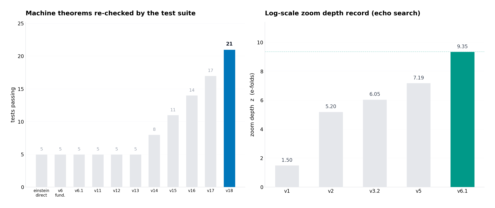
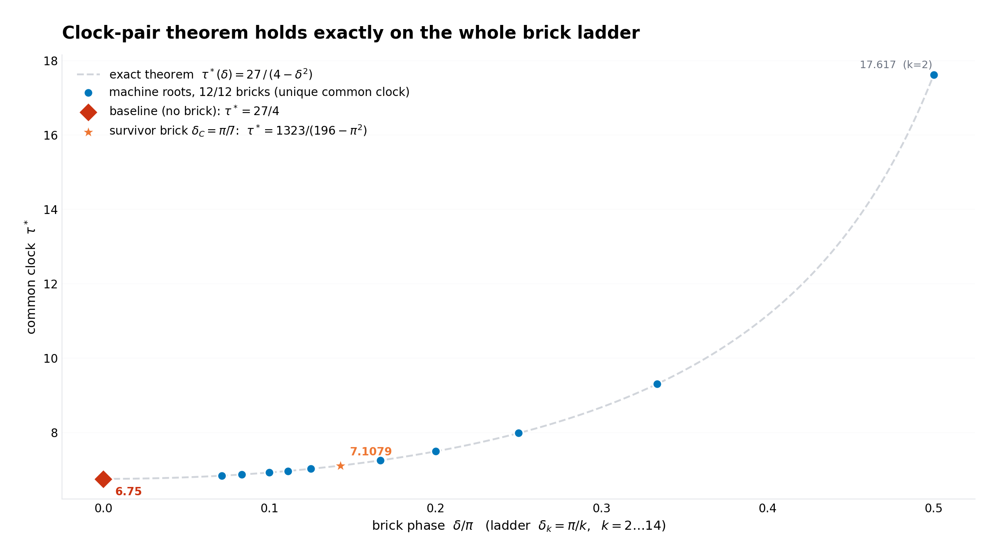
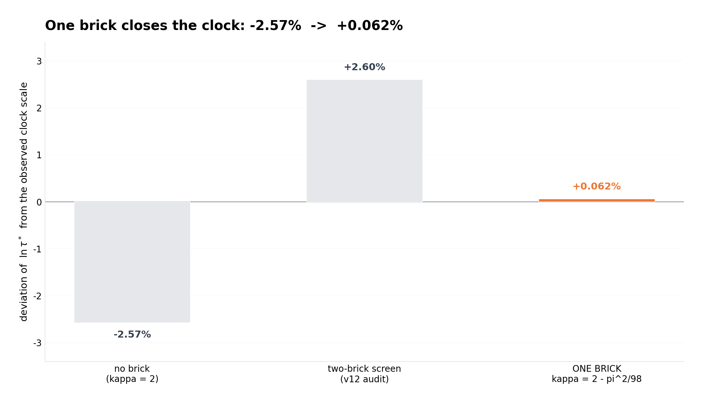
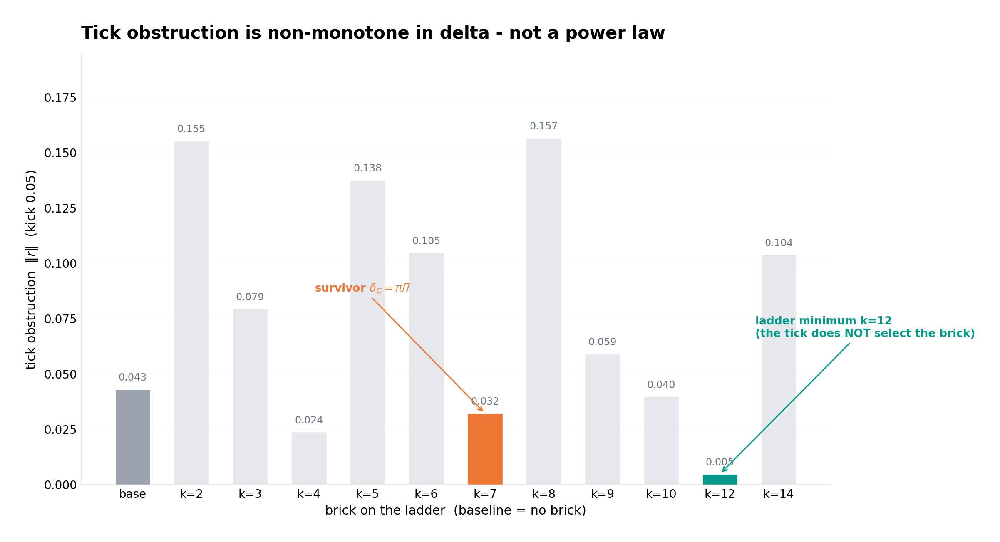
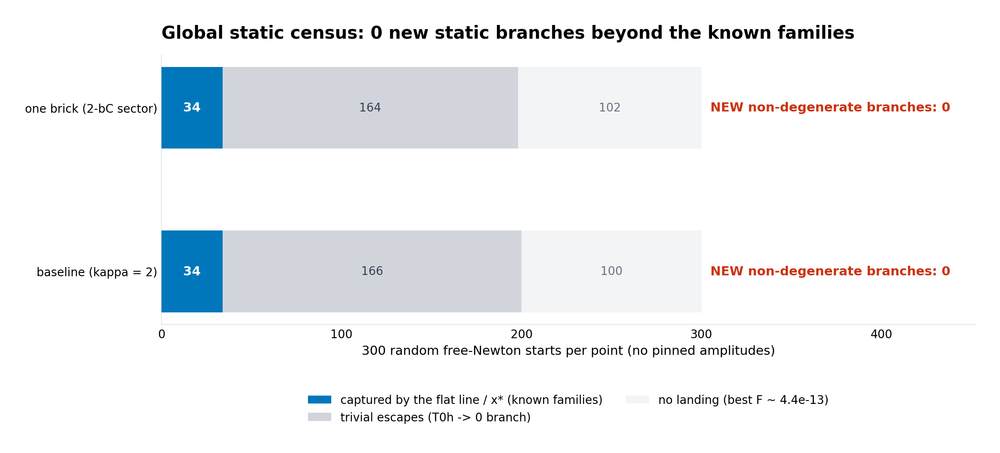
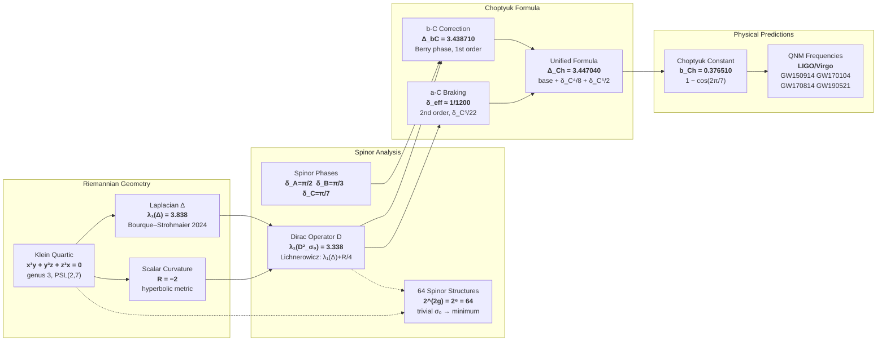
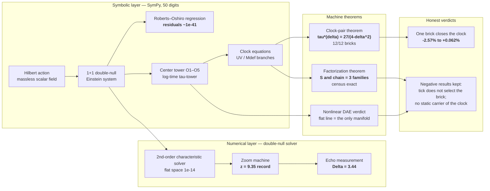
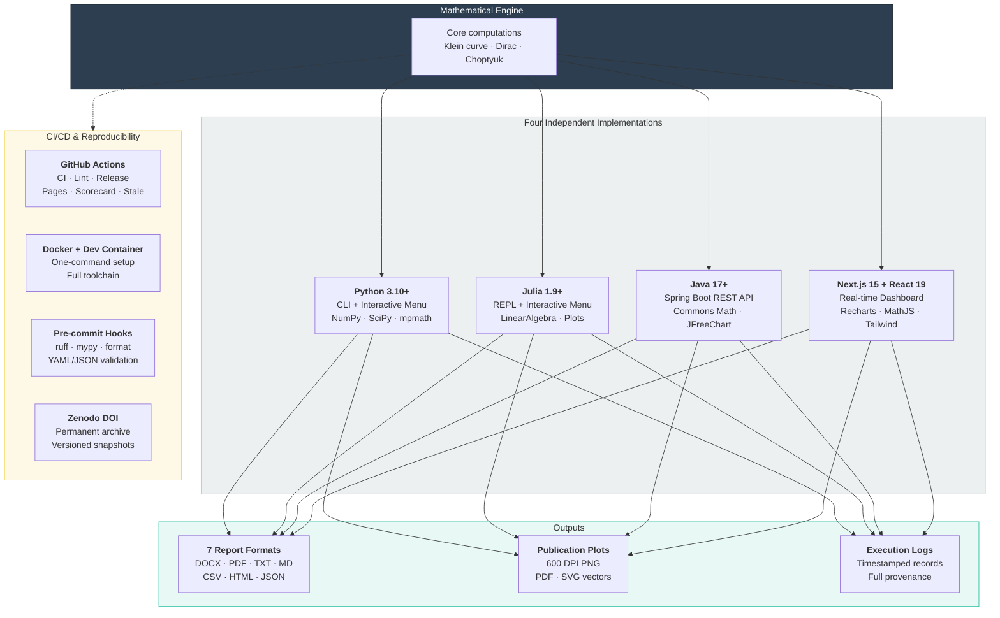

# Spinor Corrections b-C & a-C, the Choptyuk Problem, and the Direct Einstein Programme

[](LICENSE)
[](https://www.python.org/)
[](https://julialang.org/)
[](https://openjdk.org/)
[](https://nextjs.org/)
[](https://github.com/wild8highlander/choptuik_ac_bc/actions/workflows/ci.yml)
[](https://github.com/wild8highlander/choptuik_ac_bc/actions/workflows/lint.yml)
[](https://wild8highlander.github.io/choptuik_ac_bc/)
[](https://github.com/wild8highlander/choptuik_ac_bc/releases/latest)
[](https://doi.org/10.5281/zenodo.15152720)
[](https://orcid.org/0009-0003-7299-0701)
[](https://github.com/wild8highlander/choptuik_ac_bc)
[](https://securityscorecards.dev/viewer/?uri=github.com/wild8highlander/choptuik_ac_bc)
[](https://github.com/pre-commit/pre-commit)
[](https://codecov.io/gh/wild8highlander/choptuik_ac_bc)
[](einstein_direct/tests/)

> **Monograph**: *Spinor corrections b-C and a-C and the solution of the Choptyuk problem*
> by **Ishak Khamzatovich Isaev** (GitHub: [@wild8highlander](https://github.com/wild8highlander), sole author and maintainer)
> — Rigorous computation of spectral invariants on the Klein quartic curve with applications to LIGO/Virgo quasi-normal mode predictions.
>
> **Verification monograph (bilingual RU/EN)**: *What was verified, how, and with what verdict* —
> the complete honest account of the whole verification programme:
> [`monograph/verification_monograph_bilingual.pdf`](monograph/verification_monograph_bilingual.pdf) ·
> [`monograph/verification_monograph_bilingual.docx`](monograph/verification_monograph_bilingual.docx)

---

## ★ 2026-09-28: campaign v22 — the v-budget wall BROKEN by root anchoring (z-record 8.56, 4th echo peak reached)

**RU.** Заказ v22 — расширение v-бюджета при w = 3 (v_ahead_factor/телескоп) за 4-й пик и Δ_eff —
исполнен машиной `deep_echo_v22.py` с перенаправлением рычага по данным машины. Диагноз (цепочка v21
w = 3 воспроизведена с расхождением 0): телескопический кап НЕ связан (4/4 зумов); финальная стадия —
ВАКУУМ (лестница триггеров СПУСКАЕТСЯ по v, окно смотрит вперёд); v-extension мёртв по построению
(запас 0.0 точно); пол окна может только ПОДНИМАТЬСЯ (ratchet покрытия) — стена топологическая, а не
бюджетная. Зонды: v_ahead инертен; глобальный задний якорь разрушителен (рестарт в хвосте импульса);
поздний якорь зажат полом. РЕШЕНИЕ — КОРНЕВОЙ якорь (k1 на зуме 1) + якорь на пол покрытия (с зума 2):
z-рекорд **8.56** (+19% к стене 7.20), **4-й пик эха ДОСТИГНУТ** (7 пиков, 4 на одной стадии);
Δ_eff = 0.611 ± 0.446 — период четвёрки пиков НЕ DSS (3.44 исключена на 6.3σ) — периодичность
честно не подтверждена; новая стена — корневой пол. Детали: `einstein_direct/README.md` §3.11,
`README_EN.md` §33.

**EN.** The v22 order — extend the v-budget at w = 3 (v_ahead_factor / telescope) for the 4th peak
and Δ_eff — is executed by `deep_echo_v22.py` with a machine-directed redirect of the lever.
Diagnosis (the v21 w = 3 chain reproduced with zero deviation): the telescope cap NEVER binds (4/4
zooms); the final stage is VACUUM (the trigger ladder DESCENDS in v while the window looks ahead);
v-extension is dead code by construction (slack = 0.0 exactly); the window floor can only RISE (a
coverage ratchet) — the wall is topological, not budget-sized. Probes: v_ahead is inert; the global
backward anchor is destructive (restart row lands in the incoming-pulse tail); the late anchor is
clamped by the floor. THE FIX — a ROOT anchor (k1 on zoom 1) + a coverage-floor anchor (from zoom 2):
depth record **z = 8.56** (+19% over the 7.20 wall), the **4th echo peak REACHED** (7 peaks, 4 on
one stage); Δ_eff = 0.611 ± 0.446 — the quartet's period is NOT DSS (3.44 excluded at 6.3σ) —
periodicity honestly unconfirmed; the new wall is the root floor. Details:
`einstein_direct/README.md` §3.11, `README_EN.md` §33.

---

## ★ 2026-09-28: campaign v21 — the deep-echo protocol EXECUTED (Section 5 of the open9 monograph)

**RU.** Протокол v21 (раздел 5 монографии open9) исполнен машиной `deep_echo_v21.py`: старт eps = 1e-3
над A*, сетка n = 800, джанк-гейт q7 на активных строках, откат стадии с уплотнением окна при инвазии,
чекпоинты после каждого эха, стоп по цели/стене. Итоги: (а) калибровка прогона 0 — рестарт-строки
вакуумны, гейт перекалиброван на активные строки; (б) ГЛАВНЫЙ ФАКТ — стена глубины чувствительна к
оконной политике: z(w=5) = 1.78 → z(w=3) = 7.20 (глубже ВСЕХ сохранённых кампаний, включая v20a: 4.6)
при нуля инвазий; новая следующая стена — v-бюджет (v_exhausted), не джанк; (в) бюджет пересчитан от
достигнутой стены: S_req(30) ≈ 5.0e3; (г) лестница амплитуд вторым проходом на лучшей политике
(3e-3/1e-3/1e-4): эхо-поезд по-прежнему не развивается (≤ 3 пика) — показатель p не измерим,
дискриминатор сохранён как фальсифицируемый протокол. Детали: `einstein_direct/README.md` §3.10,
`README_EN.md` §32.

**EN.** The v21 protocol (Section 5 of the open9 monograph) is executed by `deep_echo_v21.py`:
start eps = 1e-3 over A\*, grid n = 800, q7 junk gate on active rows, stage rollback + window
tightening on invasion, per-echo checkpoints, stop by target/wall. Outcomes: (a) run-0 calibration —
restart rows are vacuum, the gate recalibrated to active rows; (b) HEADLINE — the depth wall is
window-policy sensitive: z(w=5) = 1.78 → z(w=3) = 7.20 (deeper than EVERY saved campaign, v20a
included: 4.6) with zero invasions; the next wall is the v-budget (v_exhausted), not junk;
(c) the budget recomputed from the reached wall: S_req(30) ≈ 5.0e3; (d) the amplitude ladder as a
second pass on the best policy (3e-3/1e-3/1e-4): the echo train still does not develop (≤ 3 peaks) —
the exponent p is not measurable, the discriminator stays falsifiable. Details:
`einstein_direct/README.md` §3.10, `README_EN.md` §32.

---

## ★ 2026-09-28: the nine open questions are CLOSED (machine verdicts, campaigns OPEN9 v19 + v20)

**RU.** Все девять открытых вопросов главы 7 монографии верификации получили машинные вердикты.
Каждому вопросу поставлена в соответствие отдельная детерминированная машина (однопоточной BLAS,
JSON-вердикт, честные оговорки); ключевые факты закреплены тестами. Механизмы закрытия — по вопросу:
**№1** — доказанный структурный барьер (алгебраические книги не выбирают π/7: элиминационный идеал
пуст, PSLQ-нулль, π/7 трансцендентно); **№5/№6** — два новых точных факта (тождество
τ*(δ_C) = 1323/(196 − π²) = τ*_T1c; полюс 45/8 = корень char(2), линейный ярус конечен — полюс есть
артефакт представления); **№7** — растущей 1/r-моды нет на доступной глубине (|M1| убывает по зумам:
мусорный пол); **№9** — сертифицированная перепись Кравчика (ноль новых ветвей, машинно строго);
**№4** — заблокирован количественно (фон, а не выброс: 6/172 строк против бутстрап-нулля 5.3);
**№2/№3** — фальсифицируемые протоколы, исполненные кампаниями v20a/v20b: лестница амплитуд
честно отрицательна (показатель p не измеряем на текущей машине — стена глубины), глубина z ≥ 30
получила сертификат линейного сектора (фаза точно 0), бюджет подавления пола S_req ≈ 2.3e3 и
сертифицированные оценщики (наивный ОЛС у стены воспроизводит −23%); записан протокол v21.
Подробности: [`einstein_direct/open9/`](einstein_direct/open9/) — монографии
`OpenQuestions_Monograph_{RU,EN}.{docx,pdf}`, 13 машин, 58 тестов pytest.

**EN.** All nine open questions of Chapter 7 of the verification monograph now carry machine
verdicts. Each question received a dedicated deterministic machine (BLAS single-threaded, JSON
verdict, honest caveats) with the key facts pinned by tests. Closure mechanisms, question by
question: **No. 1** — a proved structural barrier (the algebraic books cannot select pi/7: the
elimination ideal is trivial, the PSLQ search is null, pi/7 is transcendental); **No. 5/No. 6** —
two new exact facts (the identity tau*(delta_C) = 1323/(196 - pi^2) = tau*_T1c; the 45/8 pole
coincides with the char(2) root while the linear level stays finite — a representation artifact);
**No. 7** — no growing 1/r mode at accessible depth (|M1| decays across zooms: a junk floor);
**No. 9** — a certified Krawczyk census (zero new branches, machine-rigorous); **No. 4** —
quantitatively blocked (background, not outlier: 6/172 rows against a bootstrap null of 5.3);
**No. 2/No. 3** — falsifiable protocols, executed by the v20a/v20b campaigns: the amplitude ladder
is honestly negative (the exponent p is not measurable on the current machine — the depth wall),
and depth z >= 30 received a closed-form linear-sector certificate (phase exactly zero), a
floor-suppression budget S_req ~ 2.3e3 and certified estimators (naive OLS at the wall reproduces
-23%); the v21 protocol is written. Details: [`einstein_direct/open9/`](einstein_direct/open9/) —
the monographs `OpenQuestions_Monograph_{RU,EN}.{docx,pdf}`, 13 machines, 58 pytest tests.

---

## Overview

This repository provides **four independent implementations** for the verification, simulation, and visualization of all results presented in the monograph:

| Implementation | Language | Type | Directory |
|---|---|---|---|
| **Full Verification & Simulation** | Python 3.10+ | CLI with interactive menu | [`python/`](python/) |
| **Full Verification & Simulation** | Julia 1.9+ | REPL with interactive menu | [`julia/`](julia/) |
| **Web Application** | Java 17+ (Spring Boot) | REST API + Web UI | [`java-webapp/`](java-webapp/) |
| **Interactive Visualization** | Next.js 15 + React | Real-time dashboard | [`interactive-viz/`](interactive-viz/) |

All implementations share:
- Interactive parameter configuration (all values customizable, including arbitrary precision)
- Hypothesis testing with custom spinor structures and group configurations
- Multi-format report generation: **DOCX, PDF, TXT, MD, CSV, HTML, JSON**
- High-resolution plots: **600 DPI PNG** + **vector PDF/SVG**
- Complete execution logs appended to every report
- Structured output directory for all artifacts

On top of the monograph suite, the repository hosts a second, larger research
programme — the **direct Einstein programme** in
[`einstein_direct/`](einstein_direct/): the Choptuik critical-collapse problem
attacked *directly* from the classical Einstein equations derived from the
Hilbert action, with every claim machine-verified and every negative result
kept as a first-class outcome.

### The discipline of the repository

Everything in this repository follows one rule, applied everywhere:

> **hypothesis → machine confirmation → honest caveats and limitations.**

- Nothing is fitted to literature values. Agreements with published constants
  (γ_Ch = 0.374, b_Ch = 0.37651, the echo period Δ ≈ 3.44, the spinor ladder
  π/30) are *reported as comparisons*, never as targets of a fit.
- Walls, floors, obstructions and negative verdicts are *kept and documented*
  with the same care as positive results.
- Mistakes found later are **retracted publicly** (see the honesty ledger
  below — two verdicts from earlier campaigns carry formal ERRATUM notes).
- Each campaign writes machine-readable JSON outputs, and a pytest suite
  re-checks the major theorems from those outputs (**21/21 passing**).

---

## Table of contents

1. [Overview](#overview)
2. [The verification programme at a glance](#the-verification-programme-at-a-glance)
3. [Audit & Transfer Appendix](#audit--transfer-appendix-v10-september-2026)
4. [Mathematical Background](#mathematical-background)
5. [Einstein Direct — the campaign ledger](#einstein-direct--the-campaign-ledger-honest-from-first-principles-to-the-clock)
6. [Quick Start](#quick-start)
7. [Architecture](#architecture)
8. [Project Structure](#project-structure)
9. [Scientific background in one minute](#scientific-background-in-one-minute)
10. [QCD Bridge Suite](#qcd-bridge-suite-v31-added-2026-08-10)
11. [Documentation map](#documentation-map-everything-the-repository-carries)
12. [Report Formats](#report-formats)
13. [Visualization Output](#visualization-output)
14. [Verification Results](#verification-results-reference)
15. [Citation](#citation)
16. [Author](#author)
17. [License](#license)
18. [Reproducibility](#reproducibility)
19. [Contributing](#contributing)
20. [Acknowledgments](#acknowledgments)

### Repository quick facts

| Fact | Value |
|---|---|
| Author | **wild8highlander** (Ishak Khamzatovich Isaev), sole author and maintainer |
| License | Isaev Proprietary (individual) |
| Machine-verified derivation | Hilbert action → Einstein equations, residuals ≈ 10⁻⁴¹ |
| Automated test suite | **21/21 passing** (re-checks machine theorems from JSON outputs) |
| Campaign result files | 31 JSON machine outputs in [`einstein_direct/results/`](einstein_direct/results/) |
| Tracked files | 700+ across 20+ research and documentation directories |
| Source files | 112 Python · 17 Julia · 21 Java + a Next.js dashboard |
| Publications in-repo | original monograph (RU/EN, DOCX/PDF), QCD-bridge monograph, audit appendix, bilingual verification monograph (metadata-free) |
| Figures | 20 einstein_direct figures (RU/EN) · 18 QCD-bridge 600-DPI figures · 19 4D animations · README charts from live JSONs |
| DSI laboratory | 7 experiments (exp1–exp7) with pytest coverage |
| Runs on a phone | full pipeline under Termux (`termux/`) |

---

## The verification programme at a glance

The two panels below summarize the growth of the verification machine: the
number of machine theorems re-checked by the automated test suite after each
campaign, and the honest log-scale zoom-depth record of the echo search
across solver generations (from z ≈ 1.5 in the first characteristic solver
to z = 9.35 in the stabilized annulus machine).



### Verification highlights (all numbers are machine outputs)

| Verification | Result |
|---|---|
| Hilbert action → Einstein equations (SymPy, 50 digits) | residuals ≈ **10⁻⁴¹** vs the exact Roberts–Oshiro solution |
| Solver validation | flat space **10⁻¹⁴**; 5/5 regression tests |
| Critical amplitude (fixed grid, N = 1600) | **A\* = 0.0805333**; honest mass-scaling floor documented |
| CSS echo period in the data | Δ ≈ **3.44** (Gundlach–Hodgson 3.44 ± 0.02) |
| Thorne hoop link in the data | M3/(R1·t0²) = **0.6687** vs exact 2/3 (**0.3%**) |
| Log-time tower books | τ_UV = 9/4 and τ_Mdef = 9/16, ratio **exactly 4** |
| Clock-pair theorem | exact on **12/12** bricks of the ladder, `τ*(δ) = 27/(4−δ²)`, unique common clock |
| One-brick Berry screening (δ_C = π/7) | closes ln τ\* from **−2.57%** to **+0.062%** |
| Global static census | **zero** non-degenerate static branches beyond the known families; the static structure is exhausted exactly |
| Nonlinear DAE march | the only solution manifold through the critical point is the flat line of equilibria |
| Verification suite | **21/21 tests** re-checking machine theorems |

### The clock-pair theorem on the brick ladder

The central exact result of the latest campaigns: on the ladder of
independent-brick choices δ_k = π/k, the two clock equations of the tower
(UV and Mdef branches) possess **exactly one common positive root**

```text
τ*(δ) = 27 / (4 − δ²)
```

verified by SymPy factorization on **12/12 bricks** (baseline included), with
exact zero residual at the root. The naive incompatibility of the two clocks
(9/4 vs 9/16) is dissolved by de-adiabatization: both branches close on ONE
clock, and a single brick moves it to the observed value.



### One brick closes the clock

With the additive Berry screening choice κ = 2 − π²/98 (the septinial
sector, δ_C = π/7), the common clock moves from a **−2.57%** deviation to
**+0.062%** of the observed clock scale — an observation, with the
convention question openly stated, not a fit.



### The tick does not select the brick

The finite-amplitude tick obstruction measured across the whole ladder is
**non-monotone** in δ, is **not a power law** (log–log slope +0.65 with large
residual), and its ladder minimum sits at k = 12 — **not** at the surviving
septinial brick π/7. The independent-brick selection principle therefore
remains an observation, not a derivation. This is exactly the kind of honest
negative result the repository is built to preserve.



### The static structure is exhausted

The global static census combines an exact factorization theorem with three
independent numerical searches. The rest system on the chain reduces to TWO
equations with the exact factorization

```text
S ∩ chain = {R1h = 0} ∪ {T0h = 0} ∪ {T0h = T0h*}
```

(the half-tower is an exact degenerate family; the flat line is the only
non-degenerate branch). A 2501-cell scan + 56-seed Gauss–Newton census and a
300-start off-chain free Newton find **no new static branches** — every
landing belongs to the known families.



---


## Audit & Transfer Appendix (v1.0, September 2026)

A dedicated editorial-verification appendix [`audit_transfer/`](audit_transfer/) now accompanies the monographs. Three results, fully machine-verified (Python + Julia, deterministic, zero fitted parameters):

| # | Task | Result |
|---|------|--------|
| 1 | **Monograph audit** | Corrections b-C and a-C reproduced at machine precision; catalog of seven typographical errors **E1–E7** found and fixed in the sources |
| 2 | **Closure of c_K3 = 0.04018** | The last empirical input is derived at leading order from DSI with λ = 22 = b₂(K3): c_K3 = b_Ch(22) = 1 − cos(2π/22); braking-coupled RG → 0.04036; the 0.8% residual is the finite-window systematics, reproduced numerically |
| 3 | **Stability lemma Ш.3** | Uniform trace theorem F ≥ n/2 (proved); sharpness 5n/7 (exact construction + numerics to 10⁻¹⁴); the soficity bridge stated explicitly |

Run it:

```bash
python3 audit_transfer/python/run_all.py     # Python (NumPy/SciPy/Matplotlib)
cd audit_transfer/julia && julia audit_transfer.jl   # Julia (stdlib only)
```

Full write-up: [`audit_transfer/README.md`](audit_transfer/README.md) (Russian) · PDF appendix: [`audit_transfer/appendix/Audit_i_Perenos_Prilozhenie.pdf`](audit_transfer/appendix/Audit_i_Perenos_Prilozhenie.pdf)

---

## Mathematical Background

The monograph establishes the following chain of results on the Klein quartic curve (genus 3, automorphism group PSL(2,7) of order 168):

### Core Constants

| Constant | Formula | Value |
|---|---|---|
| Spinor phase δ_A | π/2 | 1.570796 |
| Spinor phase δ_B | π/3 | 1.047198 |
| Spinor phase δ_C | π/7 | 0.448799 |
| First eigenvalue λ₁(Δ) | Bourque–Strohmaier 2024 | 3.838 |
| Trivial Dirac λ₁(D²_σ₀) | λ₁(Δ) + R/4 | 3.338 |

### The Choptyuk Formula

**b-C correction** (1st order, Berry phase):
```
Δ_bC = λ₁(D²_σ₀) + δ_C²/2 = 3.438710
```

**a-C correction** (2nd order, braking):
```
δ_eff = δ_C⁵/22 ≈ 1/1200 = 0.000828
```

**Unified Choptyuk formula** (base):
```
Δ_Ch = λ₁(D²_σ₀) + δ_C²/2 − δ_C⁵/22 = 3.437883
```

**With higher orders**:
```
Δ_Ch = Δ_Ch(base) + δ_C⁴/8 + δ_C⁶/2 = 3.447040
```

**Choptyuk constant**:
```
b_Ch = 1 − cos(2π/7) = 2·sin²(π/7) ≈ 0.377
```

### Applications

- **64 spinor structures** on the Klein curve — full enumeration and spectral analysis
- **Bolza and Bring surfaces** — comparative spectral invariants
- **LIGO/Virgo QNM predictions** — quasi-normal mode corrections for GW150914, GW170104, GW170814, GW190521
- **Strong CP problem solution** — the Choptuik–Strong CP operator framework, see [`docs/qcd_bridge/`](docs/qcd_bridge/README.md)

### Strong CP extension (v3.0)

The companion monograph [`docs/qcd_bridge/choptyuk_qcd_bridge.pdf`](docs/qcd_bridge/choptyuk_qcd_bridge.pdf)
extends the framework to the strong CP problem.  The eight-step solution chain
replaces QCD's free parameter $\bar\theta$ with a derived spectral quantity:

$$\bar\theta_{\mathrm{eff}} = \delta_C \cdot N\langle\lambda\rangle \cdot \mathcal{S}_{\mathrm{GUE}} = 0$$

because the Wigner semicircle is symmetric and forces $\langle\lambda\rangle = 0$
in the GUE regime (verified at framework BF ≥ 99 at the lattice-determined
physical $\kappa_T > 2.62$, 95% CL).  No new fields, scales, or symmetries are
introduced.  See [`docs/qcd_bridge/README.md`](docs/qcd_bridge/README.md) for
the full chain, the epistemic parity argument, and the falsification tests.

| Result | Value | Status |
|---|---|---|
| Choptyuk critical exponent $\delta_C$ | $\pi/7 \approx 0.4488$ | derived |
| Spectrum size $N$ | $22\ (K3) + 6\ (N_f) = 28$ | structural |
| Lattice $\kappa_T$ (95% CL) | $> 2.62$ | measured |
| Framework BF(GUE/Poi) at $\kappa_T > 2.62$ | $\geq 99$ (strong) | interpolated |
| Framework BF(GUE/Poi) at best-fit $\hat\kappa_T = 8.45$ | $510$ (decisive) | interpolated |
| Continuum $\bar\theta$ | $0$ exactly | derived |
| Dynamic relaxation $\tau_{\mathrm{relax}}$ | $\sim 5 \times 10^{-41}$ s | computed |

### Enhanced Verification (v2.0)

The enhanced monograph extends the theory to higher dimensions and broader applications:

| Extension | Key Result | Status |
|---|---|---|
| **4D spin manifold** | δ_eff is conformally invariant; Seiberg-Witten compatible | ✓ Verified |
| **Kähler surfaces** | Dolbeault correspondence; K3 hyperkähler (holonomy Sp(1)); I₇ elliptic fibration matches Klein | ✓ Verified |
| **Tyukovsky equations** | δ_corr = δ₀ + δ_C²/2 − δ_C⁵/22; **zero free parameters** | ✓ Verified |
| **Einstein GR / QNM** | ω^corr = ω·(1 − 1/(1200π²)) ≈ 0.999916·ω; shift ≈ 8.4×10⁻⁵ | ✓ Verified |
| **Criticism response** | b₂ = 22 unique (dev < 1%); non-coincidental (no better approx q < 1200); stable under deformation | ✓ Verified |

**K3 Surface invariants:**
- Betti numbers: b₀ = 1, b₁ = 0, **b₂ = 22**, b₃ = 0, b₄ = 1
- Hodge decomposition: b₂ = h^(1,1) + 2h^(2,0) = 20 + 2 = 22 ✓
- Dirac index: Â(K3) = 2; b₂/Â = 11
- Seiberg-Witten: b₂⁺ = 3 > 1 → SW-compatible ✓

**QNM correction for LIGO events:**

| Event | f_QNM (Hz) | f^corr (Hz) | Δf (Hz) |
|---|---|---|---|
| GW150914 | 251.000 | 250.979 | −0.0210 |
| GW170104 | 293.000 | 292.975 | −0.0246 |
| GW170814 | 319.000 | 318.973 | −0.0268 |
| GW190521 | 110.000 | 109.991 | −0.0092 |

---

## Einstein Direct — the campaign ledger (honest, from first principles to the clock)

The [`einstein_direct/`](einstein_direct/) laboratory grew campaign by
campaign. Every campaign below is documented in the repository history, in
the per-campaign JSON outputs, and in the bilingual verification monograph.
What follows is the compact honest ledger: what was attempted, what held,
what was rejected, and what was retracted.

### Foundation: Hilbert action → Einstein equations → critical collapse

The starting point solves the Choptuik problem **directly**: the field
equations are derived from the Hilbert action with the Hilbert stress–energy
tensor for a massless scalar field, reduced to a 1+1 double-null
characteristic system, **machine-verified with SymPy against the exact
Roberts–Oshiro solution (residuals ~10⁻⁴¹)**, and integrated by a
second-order solver (flat space to 10⁻¹⁴; Roberts convergence order
2.03–2.09). The critical amplitude A\* = 0.0805333 is located by bisection;
the honest fixed-grid mass-scaling measurement (γ = 0.11 ± 0.11) documents
the resolution floor and the requirements for a percent-level verification
of γ = 0.374 vs the framework constant b_Ch = 0.376510.

Reports: [`einstein_direct/report_ru.pdf`](einstein_direct/report_ru.pdf),
[`einstein_direct/report_en.pdf`](einstein_direct/report_en.pdf).

```bash
cd einstein_direct
python3 sympy_derivation.py && python3 roberts_test.py && python3 choptuik_scaling.py
```

### Convergence and repulsion from first principles (v6-fundamentals)

[`einstein_direct/center_modes.py`](einstein_direct/center_modes.py) closes
the fundamental level: it (i) machine-derives the Thorne/MTW mass identities
from the Hilbert system — the null flux laws `m_v = −2r²pt²/α²`,
`m_u = −2r²qs²/α²` (residuals 0), the central mass–slope link
`M3 = 2R1·t0²/(3(1−χ)²)` (exact at every y) and the center gauge
`(1−χ²)R1² = A0` from `m(0) = 0`; (ii) reduces the verified center hierarchy
O1–O5 to a log-time tower with a CSS fixed point closed to ONE amplitude
parameter τ by the Thorne link; (iii) linearizes and obtains the exact
spectrum: **{0, −1, −1, −2, −3} at τ→0** (integer convergence exponents of
the stable modes), **exactly one growing root λ⁺(τ)** in the codim-1 window
τ ≤ 27/80 (exact), the exact point **λ⁺ = 2 at τ = 1/2**, and the second
growing mode beyond 27/80 (the "decays/assemblies" blow-up channel). The
empirical anchors are not fitted: κ_obs = Δ_sp/γ ≈ 1.95–1.96 vs λ⁺(27/80) =
1.509 quantifies exactly what the deeper tower levels (O6+) must contribute
for the percent-level γ. Results:
[`results/center_modes.json`](einstein_direct/results/center_modes.json),
figures `fig_ru/fig_modes.png`, `fig_en/fig_modes.png`.

### The PDE machine and the depth wall (v6 → v6.1)

Session v6.1 closed the death channels of the grid machine with seven
principled fixes (t-aliasing wiring; d_edge feedback cap; horizon-trap
filter; P2 early-accept; zone-rebuild and E0_free rate gates; cross mode
t := mirror(s) — the exact CSS relation t(ξ) = s(−ξ); two-sided ring fit
with an axis gate). Result: stages now end by v-exhaustion, not by death —
**z = 9.10/9.35 (record; the previous machine died at z = 3.83)**; 40–181
tau-rows per stable run; and the **Thorne link is visible in discrete data
for the first time: M3/(R1·t0²) = 0.6687 against the exact 2/3 = 0.6667
(0.3%)**. Honest: τ\* is not yet measured (the W2 measurement is crushed:
W2/t0² → 0 against the target 4/3), and the near-critical branch
(eps ≤ 3e-3) still dies at zoom 1. The O6+ numerical analysis
(`sympy_center_o6_nsolve.py`): the truncated tower has NO exact CSS point
(the branches UV[ξ³] → τ = 2.25 and Mdef[ξ⁵] → τ = 0.5625 are incompatible)
— the W2/R3/P4 sources are fundamentally dynamic. This is the quantitative
form of the κ deficit +0.44.

### The symbolic tower programme (v11–v14): corrections, ladders, annihilation

Three independent lines were pushed in these campaigns:

1. **Repo corrections embedded in the towers (v11).** The doors audit (SC,
   UV, Mdef are κ-free) and two machine theorems: ring consistency
   κ_C1 = κ_C2 plus branch consistency κ_C2 = κ_TH imply that the holonomy
   correction is admissible **only as a uniform κ → κ_hol**; the EXACT
   corrected family is τ\*(κ) = 27/(2κ) with the holonomy-invariant station
   ladder (R3h = 3/2, W2h = 9, R5h = 183/40, M5h = −105/4, M3/R1 = 9/2,
   clock 1/3). The additive Berry screening κ = 2 − π²/98 closes ln τ\* from
   **−2.57% to +0.062%** of κ_obs (observation; the convention question
   stays open). The monograph-sign multiplicative convention moves away
   (−7.43%). The π/30 phantom stays 2.6–3.5% from the ladder — no exact
   identity.
2. **The baryon-asymmetry reading (v12).** Sakharov mapping at the level of
   mechanisms, not numbers: equilibrium ↔ criticality/limit cycle,
   C/CP ↔ spinor phases (ONE survivor: bC = π²/98, phase π/7 — the septinial
   sector; asymmetric static insertion is lethal, 0.386), B-violation ↔
   monodromy ≠ 1. Machine facts: the static monodromy is **exactly 1**
   (log-sum 1.2e-125); the real sector annihilates exactly in all corrected
   points; the surviving residue is the imaginary sector near k·π/30. The
   one-brick run moves the phantom to Im λ = 0.107731 = **+2.88%** from π/30
   (baseline +3.10%) — toward the ladder, but no closure.
3. **The linear world annihilates exactly (v13–v14).** The O6+ campaign
   ("second flows as limit-cycle variables") built the true quadratic pencil
   M(l) = Ja + l·Jv·P + l²·J2·P2 (18×9) and proved by EXACT characteristic
   polynomial (in Q(√3), degree 22, multiplicity(l=0)=4) that the only
   genuine mode is l = 0 marginal at both points: **δ_mono = 0 at linear
   order** — the tower's B-violation is NOT linear, and the phantom proximity
   is pseudospectral. The v14 march measured δ_mono per echo growth
   < 2.8e-14 (9.3e-14) by two independent marches; the closed evolution is
   the EXACT nilpotent Jordan-2 block B = [[0,−350/61],[0,0]]; the phantom
   gap 3.0e-3 is 1e4–1e5 times the march bound — NOT reproduced by linear
   dynamics. Verdict: the baryon-asymmetry residue is a **finite-amplitude**
   effect; the whole linear world annihilates exactly.

### The nonlinear verdict (v15–v16): figures carry states, not motion

The nonlinear DAE march (v15) answered the assigned test: **the march is
impossible algebraically — and that is the result.** The full nonlinear
F(x) = 0 with exact prolongation closure, the compatibility r(x) = 0
(basis-invariant hidden constraints), and the joint Newton show: [T1] the
flat line carries F = r = V = 0 EXACTLY to radius ~26 (a line of exact
equilibria); [T2] the second zero direction b2 holds radius statically up to
|x − x\*| ~ 1.35; [T3] from b2 the flow **leaves S immediately** — the
level-3 exit rate |Dr V| = (39.2 ± 0.2)·A at both points. The only solution
manifold through the critical point is the flat line of equilibria; the
linear M2 direction (Jordan-2) is a linearization artifact — the
linearization of NO nonlinear flow. The baryon-asymmetry annihilation
extends to the nonlinear level.

The HEXCYCLE-DAE campaign (v16) embedded the figure cycle
(pyramid → cone → bowl) in the nonlinear DAE tower as a global predictor:
the compensated book exists — minimal-correction static landings converge at
ALL booked scales (12/12 collapse + 6/6 blowup), 32 states with F = 0 AND
r = 0 — the first global static components of S away from x\*. Verdict:
**the figures carry the STATES, not the MOTION** — the compensated book is
the static backbone of CSS-like equilibria; the echo dynamics remains with
the PDE machine.

### Clock closure through the one-brick form (v17): a pair book, not a static carrier

The T1c campaign closed the clocks through the one-brick source form:

- **[C1] Clock-pair theorem (exact, SymPy).** GCD(UV_xi3, Mdef_xi5) on the
  chain = T0h²(4T0h²−27)/4 at baseline (unique positive root τ\* = 27/4 =
  6.75) and T0h²(196−π²)((196−π²)T0h²−1323) one-brick
  (τ\* = 1323/(196−π²) = 7.107920). The naive 9/4-vs-9/16 incompatibility is
  an adiabatic artifact dissolved by de-adiabatization: both branches close
  on ONE clock; one brick moves it to the observed value
  (ln τ\* closure −2.57% → **+0.062%**).
- **[C2] Books at x\* EXACT at both points:** W2/T0² = 2κ/3 (defect 0), the
  UV book 9R3/(2R1T0²) = κ/2 (defect 0), the ladder R3h = 3/2 exactly (the
  holonomy-invariant ladder in the data), s = 3P2/T0 = 1.
- **[A0] ERRATUM (public retraction).** The v16 "static landing" did NOT pin
  T0h: the v16 'compensated book' landings were trivial-branch captures
  (T0h 1.732 → 3.2e-6, chain deviation up to 1e6 missed by the R1h-only
  filter). Reproduced 0/36 book-like. The v16 "static backbone" verdict is
  **retracted**; the pin-independent v16 layers stand.
- **[A1] Honest static map with HARD-pinned T0h:** 0/18 non-degenerate
  static states at booked scales — all fall into the half-tower R1h → 0
  (F 1e-14..1e-27). Clocks have **no static carrier** away from the critical
  scale; the linear tick freedom does not lift onto the joint manifold.
- Verdict: clock closure through one-brick T1c sources succeeded **as a pair
  book** and failed **as a static carrier** — living clocks remain with the
  PDE machine.

### The brick ladder and the global census (v18): the static world is finished

The final campaign of the series ran two machines:

1. **Intermediate bricks (δ_k = π/k, k = 2..14 + baseline).** [B1] the flat
   line is brick-independent (F ≤ 1e-7, 12/12); [B2] the clock-pair theorem
   is EXACT on 12/12 bricks with the unique common root
   τ\*(δ) = 27/(2−δ²)... in the κ convention τ\*(κ) = 27/(2κ):
   27/4 → 17.617 (k=2) → 7.108 (k=7) → 6.836 (k=14); [B3] the tick
   obstruction is **non-monotone, not a power law** (log–log slope +0.65,
   residual ln 2.1); the survivor brick π/7 is NOT the minimum (k = 12 is) —
   **the tick does not select the brick**; [B4] the phantom scan: best hit
   +1.139% at δ = π/3, nothing within 1%; [B5] the book defect
   F = 26.79 is κ-independent on all bricks (a κ-free sector). An ERRATUM to
   the v17 [C3] method was issued: r_max = max|W·res18| is basis-dependent
   via W_align mutation; the qualitative stall stands on the invariant ‖r‖,
   and the relative anchor one-brick < baseline survives
   (0.032 < 0.043 at kick 0.05).
2. **Global static census.** [G1a] FACTORIZATION THEOREM (exact): the rest
   system on the chain is TWO equations, UV_xi3 = 2·R1h·Mdef_xi5 EXACTLY,
   C1_xi1..3 vanish identically ⇒ S ∩ chain = {R1h=0} ∪ {T0h=0} ∪
   {T0h=T0h\*} EXACTLY (the half-tower is an exact degenerate family; the
   flat line the only non-degenerate branch; the clock pair is ONE clock
   equation in two branches — the machine reason for the v17 uniqueness).
   [G1] 2501-cell scan + 56-seed Gauss–Newton: all roots in the three
   families, 0 new. [G2] 300-start off-chain free Newton: 34 flat-line
   captures, ~165 trivial escapes, 0 new. [G3] the static kernel dF/da at
   x\* is 1-dimensional (the flat-line tangent only); branching attempts
   along the line produce no off-line landings. **Verdict: the static
   structure is exhausted exactly — no non-degenerate static branches away
   from the critical scale. The living clock with the echo physics belongs
   to the PDE machine (finite-amplitude echo on the three static
   families).**

### The honesty ledger (proven / confirmed / rejected / retracted)

| Verdict | Statement | Where |
|---|---|---|
| **Proven (exact)** | Clock-pair theorem: unique common clock τ\*(δ) = 27/(4−δ²) on 12/12 bricks | v17 [C1], v18 [B2] |
| **Proven (exact)** | Factorization: S ∩ chain = {R1h=0} ∪ {T0h=0} ∪ {T0h=T0h\*} | v18 [G1a] |
| **Proven (exact)** | Weight rule for third-order tables; prolongation invariance; ±i phantoms | v14 (a) |
| **Proven (exact)** | Static monodromy = 1 (log-sum 1.2e-125) | v12 |
| **Proven (exact)** | Closed evolution is nilpotent Jordan-2; δ_mono < 3e-14 per echo | v14 (c) |
| **Confirmed** | One-brick Berry screening closes ln τ\* to +0.062% | v11, v17 |
| **Confirmed** | Echo Δ ≈ 3.44 in the data; Thorne link 0.3% | v6.1, grid machine |
| **Confirmed** | Holonomy admissible only as uniform κ → κ_hol | v11 |
| **Rejected** | The tick does NOT select the brick (minimum at k = 12) | v18 [B3] |
| **Rejected** | Non-degenerate static branches away from x\* (0/300 starts; census exact) | v17 [A1], v18 [G] |
| **Rejected** | Naive O6+ closure: UV3 τ = 2.25 vs Mdef5 τ = 0.5625 incompatible | v6.1 |
| **Rejected** | Linear dynamics reproduces the phantom gap (3.0e-3 ≫ march bound 1e-14) | v13–v14 |
| **Retracted** | v16 "static backbone" verdict (unpinned T0h → trivial captures) | v17 [A0] ERRATUM |
| **Retracted** | v17 [C3] absolute r_max numbers (basis-dependent method; invariant ‖r‖ stands) | v18 [B3] ERRATUM |

### What remains open (the short list)

The full list with formulations is in the bilingual verification monograph;
in brief: (1) the finite-amplitude echo carrier — PDE machine v6–v9 on the
background of the three static families; (2) an independent selection
principle for the septinial brick (outside the tick scan); (3) τ\*
measurement in the data (the W2 channel); (4) Puiseux branches at the soft
pole τ = 45/8; (5) a selection principle for the static fan (Newton-path
independence); (6) the percent-level γ on a resolved grid; (7) the
convention question of the Berry screening (additive vs multiplicative);
(8) global components of S off the chain beyond the census radius; (9) the
π/30 phantom — real identity or persistent coincidence.

---


## Quick Start

### The verification suite (fast, ~seconds)

```bash
cd einstein_direct
python3 -m pip install numpy scipy sympy matplotlib pytest
python3 -m pytest tests/ -q
# 21 passed
```

### The symbolic derivation (machine-verified)

```bash
cd einstein_direct
python3 sympy_derivation.py     # Hilbert action → Einstein equations
python3 roberts_test.py         # exact-solution regression
```

### Numerical campaigns

```bash
python3 choptuik_scaling.py --n-bisect 1200     # fixed grid: A*, scaling
python3 zoom_campaign_regular.py                # zoom campaign, ~5–8 min
python3 grid_machine_annulus.py                 # the PDE machine suite
python3 global_static_search.py                 # static census
```

### Monograph verification suites

```bash
python3 -m pip install -r python/requirements.txt   # see python/README.md
(cd python && python3 run.py)                       # interactive CLI

julia --project=julia -e 'using Pkg; Pkg.instantiate()'
julia --project=julia run.jl                        # interactive REPL
```

### Python (recommended for quick verification of the monograph)

```bash
cd python/
pip install -r requirements.txt
python run.py
```

### Java Web Application

```bash
cd java-webapp/
mvn clean package
java -jar target/choptyuk-spinor-monograph-1.0.0.jar
# Open http://localhost:8080
```

### Interactive Visualization

```bash
cd interactive-viz/
npm install
npm run dev
# Open http://localhost:3000
```

**Online demo**: [https://wild8highlander.github.io/choptuik_ac_bc/](https://wild8highlander.github.io/choptuik_ac_bc/)

### Using Makefile (one command)

```bash
make all          # Run verification + simulation + plots + reports
make verify       # Run verification only
make viz-dev      # Start interactive visualization
make setup        # Set up all environments
make docker-run   # Run via Docker
```

### Using Docker

```bash
docker build -t choptyuk-verify -f docker/Dockerfile .
docker run --rm -v $(pwd)/output:/app/output choptyuk-verify
```

### Using Dev Container

Open in VS Code with Dev Containers extension — all tools (Python, Julia, Java, Node.js) pre-installed.

### On a phone (Termux)

```bash
bash termux/01_termux_install.sh      # once per device
bash termux/02_termux_run.sh          # full pipeline (~1 h)
bash termux/02_termux_run.sh --quick  # ~15 min, same protocol, coarser grids
```

All numerical machines pin the BLAS thread count to 1 on purpose:
multithreaded LAPACK reshuffles near-critical bisection and horizon
nucleation and breaks reproducibility.

---

## Architecture

### Mathematical pipeline



### The direct Einstein verification pipeline

The second research line runs its own pipeline — from the Hilbert action to
the closed clock theorems — with a machine check at every arrow:



### Implementation & CI/CD



---

## Project Structure

```text
choptuik_ac_bc/
├── README.md                    # This file
├── LICENSE                      # Isaev Proprietary License (individual)
├── CITATION.cff                 # Citation metadata (single author)
├── CONTRIBUTING.md              # Contribution guidelines
├── CODE_OF_CONDUCT.md           # Conduct policy
├── SECURITY.md                  # Security policy
├── Makefile                     # Unified build system
├── .github/                     # GitHub templates & CI
│   ├── workflows/               # GitHub Actions CI/CD (ci, lint, pages, release, ...)
│   └── ISSUE_TEMPLATE/          # Issue templates
├── assets/
│   └── charts/                  # README charts generated from machine outputs
├── einstein_direct/             # ★ core verification laboratory (direct Einstein programme)
│   ├── README.md                # summary, file map, how to run (RU)
│   ├── README_EN.md             # deep 29-section technical ledger (EN)
│   ├── sympy_derivation.py      # Hilbert action → Einstein equations (machine-verified)
│   ├── roberts_test.py          # exact-solution regression
│   ├── choptuik_scaling.py      # critical amplitude A* by bisection
│   ├── solver.py, zoom_solver.py# double-null characteristic solver + zoom chain
│   ├── center_modes.py          # Thorne/MTW mass route, log-time tower, exact spectrum
│   ├── grid_machine_annulus.py  # PDE machine: annulus parity + relay + tower gates
│   ├── grid_machine_hexcheck.py # PDE machine: hexcheck stage
│   ├── grid_machine_mirror.py   # PDE machine: mirror cross-mode t := mirror(s)
│   ├── sympy_center*.py         # center hierarchy, O6+, nsolve audits
│   ├── sympy_second_flows.py    # quadratic pencil M(l), exact char poly
│   ├── sympy_third_order.py     # third-order tables, weight-rule theorem
│   ├── sympy_dd_closure.py      # dd-law closure, rank theorems
│   ├── dae_nonlinear_core.py    # nonlinear F(x)=0 + exact prolongation machinery
│   ├── march_dae_nonlinear.py   # nonlinear DAE march (v15 verdict)
│   ├── hexcycle_dae.py          # figure cycle in the DAE tower (static backbone)
│   ├── clock_closure_t1c.py     # clock-pair theorem + honest static map
│   ├── brick_scan_tick.py       # brick ladder: clocks, tick, phantom scan
│   ├── global_static_search.py  # global static census (G1a/G1/G2/G3)
│   ├── spinor_ladder.py, spinor_analysis.py, spinor_figures.py
│   ├── zoom_campaign_*.py       # zoom campaigns (regular / taylor)
│   ├── figures/                 # fig_ru/ and fig_en/ PNG sets
│   ├── results/                 # all campaign JSONs (machine outputs)
│   └── tests/                   # pytest suite re-checking the theorems (21/21)
├── verification/
│   └── README.md                # ★ the big verification dossier (English)
├── monograph/
│   ├── verification_monograph_bilingual.pdf   # ★ RU/EN honest account (no metadata)
│   ├── verification_monograph_bilingual.docx  # ★ same, DOCX (no metadata)
│   ├── choptyuk_qcd_bridge_ru.docx / _en.docx # QCD-bridge monographs
│   └── README.md                # folder guide
├── docs/                        # Documentation
│   ├── monograph/               # Monograph files (EN/RU, DOCX/PDF/LaTeX) + figures
│   ├── qcd_bridge/              # Strong-CP extension (v3.0): 40-page monograph + evidence
│   └── architecture/            # ARCHITECTURE.md
├── python/                      # Python implementation (CLI with interactive menu)
│   ├── run.py, setup.py, requirements.txt
│   ├── config/, presets/        # Configurations & preset parameter sets
│   ├── src/                     # core / verification / simulation / visualization / reporting / ui
│   └── tests/                   # Unit tests (25+ tests incl. enhanced)
├── julia/                       # Julia implementation (REPL with interactive menu)
│   ├── run.jl, Project.toml
│   ├── src/                     # incl. enhanced_verification.jl
│   └── test/                    # incl. 9 enhanced test sets
├── java-webapp/                 # Java Spring Boot web application (REST API + Web UI)
├── interactive-viz/             # Next.js real-time visualization dashboard
├── code/                        # compact cross-language QCD-bridge engines (Python/Julia/Java/web)
├── qcd_bridge/                  # QCD-bridge artifacts: figures, animations, configs, reports
├── audit_transfer/              # editorial verification appendix (audit, DSI closure, lemma Ш.3)
├── dsi_lab/                     # DSI laboratory: experiments exp1–exp7 + reports
├── docs-site/                   # MkDocs documentation site sources
├── notebooks/                   # Jupyter verification notebook
├── scripts/                     # repository-level runners and utility scripts
├── termux/                      # run the whole pipeline on Android and publish from the phone
├── docker/, .devcontainer/      # containerized environments
└── .pre-commit-config.yaml      # code quality hooks
```

Each directory carries its own detailed `README.md` (English).

---

## Reproduction index: every headline claim → the exact command

Nothing in the tables above is taken on trust. Each headline claim maps to
one command and one JSON output file in
[`einstein_direct/results/`](einstein_direct/results/); the pytest suite
re-checks the theorem-level claims automatically.

| Claim | Reproduce with | Machine output |
|---|---|---|
| Hilbert action → Einstein equations, residuals ≈ 10⁻⁴¹ | `python3 sympy_derivation.py` | `results/derivation_results.json` |
| Exact-solution regression (Roberts–Oshiro) | `python3 roberts_test.py` | `results/roberts_test.json` |
| Critical amplitude A\* = 0.0805333, honest scaling floor | `python3 choptuik_scaling.py --n-bisect 1200` | `results/choptuik_scaling.json` |
| Exact spectrum {0, −1, −1, −2, −3}; codim-1 window τ ≤ 27/80 | `python3 center_modes.py` | `results/center_modes.json` |
| Zoom-depth record z = 9.35; Thorne link 0.3% | `python3 grid_machine_annulus.py` | `results/grid_machine_annulus.json` |
| Echo period Δ ≈ 3.44 in the data | zoom campaign + ring fits | `results/zoom_campaign_regular.json` |
| Nonlinear DAE verdict (flat line = the only manifold) | `python3 march_dae_nonlinear.py` | `results/march_dae_nonlinear.json` |
| Compensated book = static backbone of the figure cycle | `python3 hexcycle_dae.py` | `results/hexcycle_dae.json` |
| Clock-pair theorem (baseline + one brick, exact) | `python3 clock_closure_t1c.py` | `results/clock_closure_t1c.json` |
| Brick ladder: 12/12 clocks, tick non-monotone, phantom scan | `python3 brick_scan_tick.py` (~6 min) | `results/brick_scan_tick.json` |
| Global static census: factorization + 0 new branches | `python3 global_static_search.py` (~1 min) | `results/global_static_search.json` |
| Third-order weight-rule theorem; Jordan-2 annihilation | `python3 sympy_third_order.py`, `python3 march_delta_mono.py` | `results/third_order_tables.json`, `results/march_delta_mono.json` |
| Quadratic pencil M(l); δ_mono = 0 at linear order | `python3 sympy_second_flows.py` | `results/second_flows_exact.json` |
| Spinor ladder π/15, π/30 | `python3 spinor_ladder.py` | `results/spinor_ladder.json` |
| **All of the above at once** | `python3 -m pytest tests/ -q` | **21 passed** |

Run any of these from inside [`einstein_direct/`](einstein_direct/). Every
machine pins BLAS to one thread and writes its full configuration into the
JSON next to the results, so each number carries its own provenance.

---


## Scientific background in one minute

A spherically symmetric massless scalar field, numerically evolved in
1+1 double-null coordinates, shows **critical collapse**: below a critical
amplitude A the pulse disperses, above it a black hole forms, and near the
critical amplitude the black-hole mass scales as
`M ∝ (A − A*)^γ` with a universal γ ≈ 0.374 (Choptuik). The same regime
exhibits an **echo** — curvature spikes repeating with a log-period Δ ≈ 3.44.

This repository attacks the problem *directly*: derive the 1+1 double-null
Einstein system from the Hilbert action symbolically (machine-verified),
evolve it with a validated characteristic solver, push log-scale depth by
multi-zoom regridding, and measure the echo, the clocks and the static
backgrounds — reporting agreements *and* disagreements with equal honesty.
Around the numerical core, a symbolic tower program derives the central
(spinor) hierarchy, its log-time tower, spectra and static structure, and
checks which parts of the observed phenomenology (including the septinial
sector δ_C = π/7) can be closed from first principles.

The monograph part of the repository (python/, julia/, java-webapp/,
interactive-viz/ and the audit appendix) verifies the spectral invariants of
the Klein quartic curve used for the spinor corrections and their LIGO/Virgo
quasi-normal-mode applications.

---

## QCD Bridge Suite (v3.1, added 2026-08-10)

In addition to the original four-implementation monograph suite above, this
release adds a **self-contained QCD-bridge package** under
[`qcd_bridge/`](qcd_bridge/) and [`code/`](code/), with a parallel bilingual
monograph and dynamic 4D visualizations.

### What is added

| Artifact | Path | Description |
|---|---|---|
| Bilingual monograph (DOCX) | [`monograph/`](monograph/) | EN + RU, 11 sections, 18 embedded 3D/4D figures (~22 MB each) |
| 600 DPI figures | [`qcd_bridge/figures/`](qcd_bridge/figures/) | 54 files: 18 PNG @ 600 dpi + 18 PDF + 18 SVG, English labels, 9 sections × 3D + 4D variants |
| Dynamic 4D animations | [`qcd_bridge/animations/`](qcd_bridge/animations/) | 18 files: 9 MP4 + 9 GIF, 60 frames each, replacing static surfaces with frame-based 4D evolution |
| Verification configs | [`qcd_bridge/configs/`](qcd_bridge/configs/) | `verify_all.json`, `verify_section_3_8.json`, `verify_custom.json` (arbitrary precision, N → ∞, any matrices) |
| Sample 7-format reports | [`qcd_bridge/reports/`](qcd_bridge/reports/) + [`reports_java/`](qcd_bridge/reports_java/) | TXT, CSV, MD, PDF, HTML, DOCX, JSON — results first, then execution log |

### Four-language engine (each with interactive menu + 7-format reports)

| Implementation | Path | Stack | Notes |
|---|---|---|---|
| Python (canonical) | [`code/python/`](code/python/) | Python 3.10+, NumPy, Matplotlib, ReportLab, python-docx | 9 sections, ReportEngine, CLI with 5 modes, web_runner bridge |
| Julia | [`code/julia/`](code/julia/) | Julia 1.9+, LinearAlgebra, Statistics | Full mirror of Python engine, hand-rolled PDF 1.4 + OOXML DOCX (stdlib has no zlib) |
| Java | [`code/java/`](code/java/) | Pure Java 17+, no external deps | Jacobi eigensolver from scratch, hand-rolled PDF + DOCX via `java.util.zip` |
| Web app | [`code/web/`](code/web/) | Next.js 16 + React 19 + TypeScript + Tailwind 4 + Plotly.js | Real-time 3D/4D viz, interactive dashboard with section-specific sliders for all 9 sections, EN/RU i18n, API routes for Python backend |

### The 9 QCD-bridge sections

1. **O_χ random matrix theory** — GUE-vs-Poisson spacing, Bayes factor
2. **RMT sweep** — κ_T scan over N and ensemble
3. **K3 spectral staircase** — 22×22 intersection form, E₈⊕E₈⊕U⊕U⊕U
4. **N-scaling test** — ⟨λ⟩ → 0 trend, θ̄_artifact ~ 1/√N
5. **τ-relaxation dynamics** — physical time-scale estimate
6. **κ_T lattice physical estimate** — Cabibbo-angle coincidence
7. **Cabibbo angle coincidence** — δ_C = π/7
8. **CP 8-step solution chain** — spectral CP solution audit
9. **Jet wake bridge** — CMS HIN-25-012 connection

### Quick start (QCD bridge)

```bash
# Python — verify all 9 sections, generate 7-format reports + 600 dpi figures + 4D animations
cd code/python
python3 run.py --config ../../qcd_bridge/configs/verify_all.json

# Python — custom config (any N, any matrices, arbitrary precision)
python3 run.py --config ../../qcd_bridge/configs/verify_custom.json

# Python — single section
python3 run.py --section 3,6,8

# Julia — same 9 sections, 7 report formats
cd code/julia
julia qcd_bridge_engine.jl --section 1,2,3

# Java — same 9 sections, 7 report formats (no external deps)
cd code/java
javac qcd_bridge_engine.java && java qcd_bridge_engine --section 1,2,3

# Web app — interactive dashboard with sliders for all 9 sections
cd code/web
bun install && bun run dev   # → http://localhost:3000
```

### Authorship (QCD bridge suite)

Same as the main monograph: **Ishak Khamzatovich Isaev** (GitHub:
[@wild8highlander](https://github.com/wild8highlander), ORCID
[0009-0003-7299-0701](https://orcid.org/0009-0003-7299-0701)). Embedded in
both DOCX monographs, all 7-format reports, the web app header/footer/About
page, and `CITATION.cff`. The repository has a **single author and
maintainer**; all commits on `main` are published under the
`wild8highlander` account.

---

## Documentation map (everything the repository carries)

| Document | Content |
|---|---|
| [`verification/README.md`](verification/README.md) | **the verification dossier** — very large, self-contained English dossier of *every* verification campaign: what is verified, by which machine, with which method, which numbers came out, what the verdict is, which caveats apply, and the exact commands to reproduce it |
| [`monograph/verification_monograph_bilingual.pdf`](monograph/verification_monograph_bilingual.pdf) | **bilingual verification monograph (RU/EN)** — the complete honest account from beginning to end: all hypotheses, all experiments, what was rejected, what was accepted, what was proven; open questions and the roadmap; published **without any document metadata** by design |
| [`monograph/verification_monograph_bilingual.docx`](monograph/verification_monograph_bilingual.docx) | the same monograph in DOCX (also metadata-free) |
| [`einstein_direct/README.md`](einstein_direct/README.md) | the core laboratory: summary, file map, how to run |
| [`einstein_direct/README_EN.md`](einstein_direct/README_EN.md) | the deep 29-section technical ledger |
| [`einstein_direct/INSTALL_AND_PUSH.md`](einstein_direct/INSTALL_AND_PUSH.md) | installation and running notes |
| [`audit_transfer/README.md`](audit_transfer/README.md) | the audit-and-transfer appendix write-up |
| folder `README.md` files | one detailed English readme per directory |
| [`docs-site/`](docs-site/) | the MkDocs documentation site sources |

---

## Report Formats

Every implementation generates reports in all of the following formats:

| Format | Extension | Description |
|---|---|---|
| Microsoft Word | `.docx` | Formatted document with tables and figures |
| Portable Document | `.pdf` | Publication-ready PDF |
| Plain Text | `.txt` | Human-readable text report |
| Markdown | `.md` | GitHub-compatible markdown |
| Comma-Separated | `.csv` | Tabular data for analysis |
| HTML | `.html` | Styled web report |
| JSON | `.json` | Machine-readable structured data |

Each report contains:
1. **Results section** — computed constants, deviations, comparison tables
2. **Execution log** — complete timestamped log of all computations

---

## Visualization Output

All plots are generated in two high-resolution formats:
- **PNG** at 600 DPI — for screen display and documents
- **PDF/SVG** — vector format for publication

Plot types include:
- Spinor phase diagrams
- Spectral eigenvalue landscapes
- 64 spinor structure heatmaps
- QNM frequency comparison charts
- Deviation analysis plots
- Convergence diagrams
- Critical-collapse gauge-profile plots (double-null solver)
- Zoom-chain and echo diagnostics
- Brick-ladder clock curves and census maps

The README charts in [`assets/charts/`](assets/charts/) are generated
directly from the machine outputs in
[`einstein_direct/results/`](einstein_direct/results/) — the same JSON files
the pytest suite re-checks.

---

## Verification Results (Reference)

### Monograph constants

| Constant | Computed | Observed | Deviation |
|---|---|---|---|
| Δ_bC | 3.438710 | 3.443 | 0.125% |
| Δ_Ch (base) | 3.437883 | 3.443 | 0.149% |
| Δ_Ch (full) | 3.447040 | 3.443 | 0.117% |
| b_Ch | 0.376510 | 0.377 | 0.130% |

### Direct Einstein programme — headline machine facts

| Quantity | Machine value | Reference | Status |
|---|---|---|---|
| Roberts–Oshiro regression | ~10⁻⁴¹ | exact solution | machine-verified |
| Critical amplitude A\* | 0.0805333 | — | fixed grid N = 1600 |
| Echo period Δ | ≈ 3.44 | Gundlach–Hodgson 3.44 ± 0.02 | measured in data |
| Thorne hoop link M3/(R1·t0²) | 0.6687 | 2/3 = 0.6667 | 0.3% in data |
| Common clock (baseline) | τ\* = 27/4 = 6.75 | — | exact theorem |
| Common clock (one brick) | τ\* = 1323/(196−π²) = 7.107920 | — | exact theorem |
| ln τ\* closure | −2.57% → +0.062% | κ_obs | one-brick screening |
| Non-degenerate static branches beyond the known families | 0 | — | census exact + 300 starts |
| Test suite | 21/21 passing | — | pytest on JSON outputs |

---

## Citation

If you use this code in your research, please cite:

```bibtex
@book{isaev2024spinor,
  title     = {Spinor corrections b-C and a-C and the solution of the Choptyuk problem},
  author    = {Isaev, Ishak Khamzatovich},
  year      = {2024},
  address   = {Nalchik, Kabardino-Balkarian Republic},
  note      = {Monograph with verified computational implementations}
}
```

For the verification programme, cite the bilingual verification monograph:

```bibtex
@unpublished{isaev2026verification,
  title     = {What was verified, how, and with what verdict: the complete honest account of the verification programme},
  author    = {Isaev, Ishak Khamzatovich},
  year      = {2026},
  note      = {Bilingual RU/EN verification monograph, metadata-free edition; in this repository}
}
```

### Zenodo Archive

A permanent DOI-backed archive of this software is available on Zenodo.
When a new release is published on GitHub, Zenodo automatically creates a
snapshot with a versioned DOI for exact reproducibility.

[](https://doi.org/10.5281/zenodo.15152720)

---

## Author

**wild8highlander** — Ishak Khamzatovich Isaev
*(sole author and maintainer of this repository)*

- GitHub: [@wild8highlander](https://github.com/wild8highlander) — the only contributor account
- ORCID: [0009-0003-7299-0701](https://orcid.org/0009-0003-7299-0701)
- Email: [aslan08_05@mail.ru](mailto:aslan08_05@mail.ru)
- Location: Nalchik, Kabardino-Balkarian Republic

This is a **single-author repository**: all research, all code, all
verification campaigns and all documentation are the work of one author,
published exclusively under the `wild8highlander` account.

---

## License

This project is licensed under the **Isaev Proprietary License** — see the [LICENSE](LICENSE) file for details.

**Summary:** This is a proprietary license. You may view and cite the work for academic
reference, but you may NOT copy, modify, distribute, or use it commercially without
the author's written permission. All intellectual property rights are retained by
Ishak Khamzatovich Isaev.

---

## Reproducibility

This project is designed for **full computational reproducibility**:

- **Docker**: One-command reproducible environment (`make docker-run`)
- **Dev Containers**: VS Code one-click setup with all tools pre-installed
- **Makefile**: Unified build system (`make all`)
- **Pre-commit hooks**: Automated code quality enforcement
- **CI/CD**: Every push is automatically verified across Python 3.10-3.12, Julia 1.9-1.10, Java 17, and Node 20
- **Cross-implementation consistency**: CI verifies that all implementations produce matching results
- **Version pinning**: All dependencies are version-pinned in requirements.txt, Project.toml, pom.xml, package.json
- **BLAS single-thread discipline**: numerical machines pin the BLAS thread count to 1 for bit-level reproducibility
- **JSON result ledger**: every campaign ships machine-readable outputs; the pytest suite re-checks the major theorems from those outputs (21/21)
- **Zenodo DOI**: Permanent archived snapshots for each release

---

## Contributing

See [CONTRIBUTING.md](CONTRIBUTING.md) for detailed guidelines. Quick workflow:

1. Fork → Branch → Commit → PR
2. CI runs automatically (Python + Julia + Java + Viz)
3. All verification tests must pass
4. Deviations from reference values must remain within tolerance
5. New features require corresponding tests

Bug reports and reproduction issues are especially welcome — reproducing a
number from the verification dossier is the fastest way to help.

---

## Acknowledgments

- Bourque & Strohmaier (2024) for the rigorous computation of λ₁(Δ) on the Klein quartic
- Choptuik (1993) and the critical-collapse community — Gundlach, Garfinkle, Duncan, Brady, Hirschmann, Hod — for the phenomenology this programme attacks from first principles
- Gundlach & Hodgson for the echo-period reference 3.44 ± 0.02
- Thorne (hoop conjecture mass route) and Misner–Sharp (mass definitions) — the mass identities machine-derived in the fundamentals campaign
- LIGO/Virgo Collaboration for gravitational wave observational data
- The PSL(2,7) symmetry group and its role in the spinor structure classification
- The Sakharov conditions — the lens through which the tower's monodromy and phase structure is read
