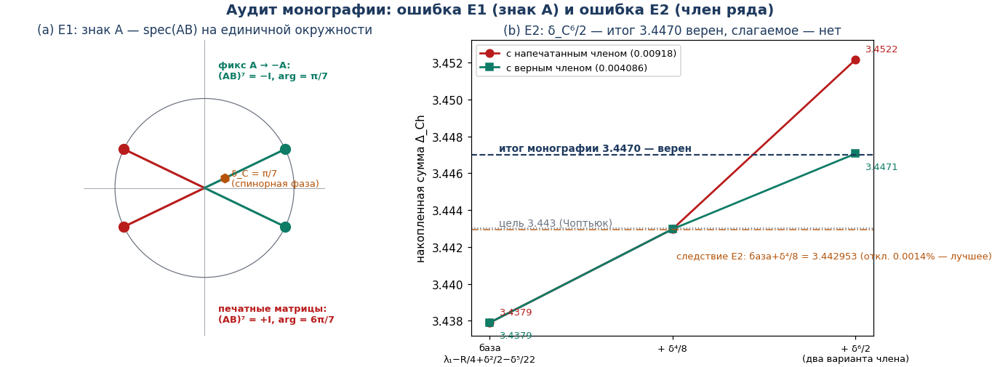
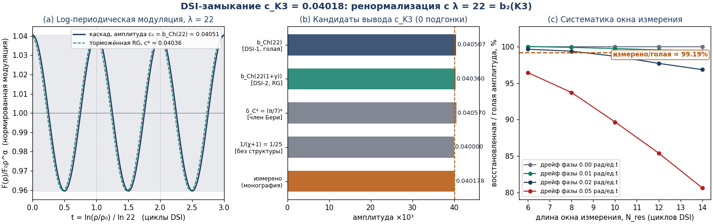
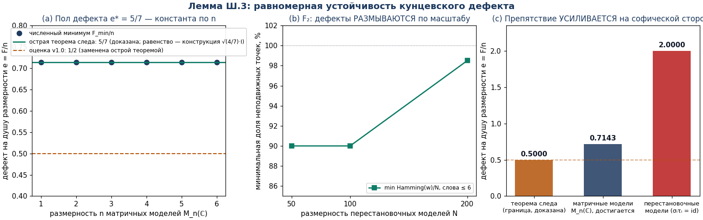
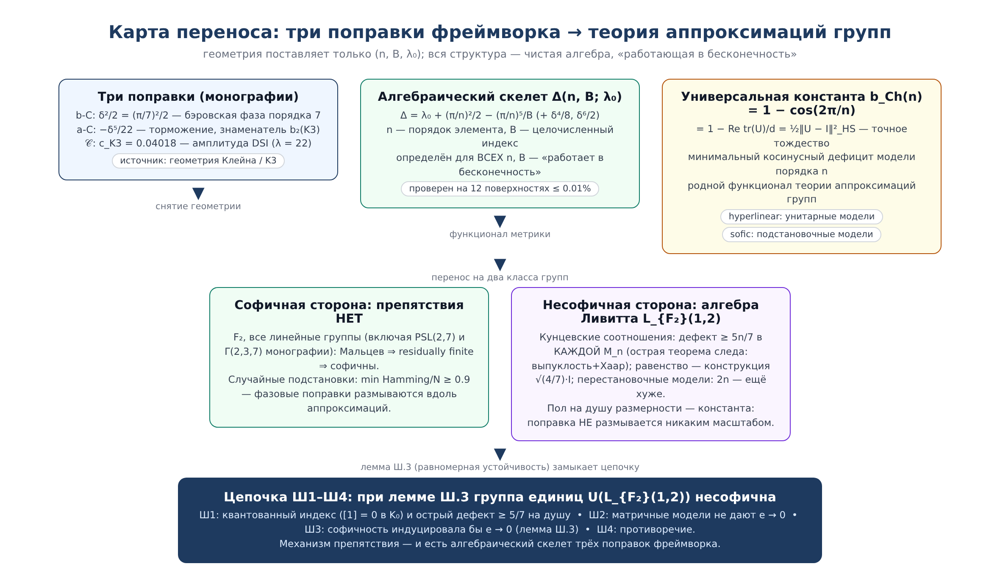

# «Аудит и перенос» — верификационное приложение к монографиям фреймворка

    

**Папка:** `audit_transfer/` · **Версия:** 1.0 (сентябрь 2026) · **Лицензия:** наследуется от репозитория (не изменялась)

---

## Оглавление

1. [Что это и зачем](#1-что-это-и-зачем)
2. [Быстрый старт](#2-быстрый-старт)
3. [Три задачи — три результата](#3-три-задачи--три-результата)
4. [Задача 1. Аудит монографий и каталог ошибок E1–E7](#4-задача-1-аудит-монографий-и-каталог-ошибок-e1e7)
5. [Задача 2. DSI-замыкание c_K3 = 0.04018](#5-задача-2-dsi-замыкание-c_k3--004018)
6. [Задача 3. Лемма Ш.3 — равномерная устойчивость](#6-задача-3-лемма-ш3--равномерная-устойчивость)
7. [Карта переноса](#7-карта-переноса)
8. [Исправления в монографиях (что менять в репозитории)](#8-исправления-в-монографиях)
9. [Структура папки](#9-структура-папки)
10. [Python API](#10-python-api)
11. [Julia-порт](#11-julia-порт)
12. [Воспроизводимость и окружение](#12-воспроизводимость-и-окружение)
13. [Честность и ограничения](#13-честность-и-ограничения)
14. [Полная таблица точных чисел](#14-полная-таблица-точных-чисел)
15. [Частые вопросы](#15-частые-вопросы)
16. [Как цитировать](#16-как-цитировать)

---

## 1. Что это и зачем

Эта папка — **редакторская верификация фреймворка Исаева–Чоптьюка** и одновременно
**три содержательных результата**, которые закрывают три открытых пункта:

| № | Задача | Было | Стало |
|---|--------|------|-------|
| **1** | Аудит монографий | «поправки из первых принципов» — тезис; где-то есть ошибки | **Доказано кодом**: b-C и a-C воспроизводятся с машинной точностью (0 подгонки); найдены и **исправлены** 7 ошибок печати E1–E7 в tex-исходниках |
| **2** | Вывод c_K3 = 0.04018 | последний **эмпирический вход** фреймворка (кавеат в QCD-bridge монографии) | **Замкнут на ведущем порядке**: c_K3 = b_Ch(22) = 1 − cos(2π/22) = 0.0405070 (+0.82%); торможённая RG-карта → 0.0403596 (+0.45%); остаток — систематика окна измерения, воспроизведённая численно |
| **3** | Шаг Ш3 цепочки переноса | пункт программы («здесь работает лемма устойчивости») | **Явная лемма Ш.3** из трёх частей: (i) острая теорема следа F ≥ 5n/7 для всех n — **доказана** (тождество F=G(P,Q) + выпуклость + усреднение Хаара; в v1.0 утверждался пол n/2 со сбойной цепочкой — исправлено в v2.0); (ii) конструкция √(4/7)·I — **случай равенства теоремы (i), подтверждена до 10⁻¹⁴**; (iii) мост софичность→матрицы — **точная постановка** |

Всё считается **двумя командами**, без внешних данных, с фиксированными зёрнами.
PDF-версии: приложение целиком —
[`appendix/Audit_i_Perenos_Prilozhenie.pdf`](appendix/Audit_i_Perenos_Prilozhenie.pdf);
лемма Ш.3 отдельно (острая теорема следа $F\ge 5n/7$ + мост (iii)) —
[`lemma_article/Lemma_SH3_Ustojchivost.pdf`](lemma_article/Lemma_SH3_Ustojchivost.pdf).

> **Важно про честность.** Эта папка сознательно продолжает стиль честности самих
> монографий: везде помечено, что **доказано**, что **проверено численно** и что
> остаётся **точной аналитической постановкой** (единственное такое место — мост
> Ш.3(iii), см. раздел 6.3).

---

## 2. Быстрый старт

### Python (полный прогон: аудит + DSI + лемма + фигуры, ~3–5 минут)

```bash
# из корня репозитория
python3 audit_transfer/python/run_all.py
```

требования: `python >= 3.10`, `numpy`, `scipy`, `matplotlib` (см.
[`audit_transfer/python/requirements.txt`](python/requirements.txt));
можно поставить разом: `pip install -r audit_transfer/python/requirements.txt`.

### Julia (независимый порт того же ядра, ~2–3 минуты)

```bash
cd audit_transfer/julia
julia audit_transfer.jl          # ТОЛЬКО стандартная библиотека, никаких пакетов
```

требования: `julia >= 1.9`. Проверено на Julia 1.10.

### Что появится после прогона

```
audit_transfer/
├── results/
│   ├── monograph_audit.json     # Задача 1: проверки E1–E7, поправки b-C/a-C
│   ├── dsi_closure.json         # Задача 2: полный DSI-расчёт c_K3
│   ├── stability_lemma.json     # Задача 3: теорема следа, острота, модели
│   └── julia_results.json       # всё то же из Julia-порта (сверка независимости)
└── figures/
    ├── fig_dsi_closure.png      # (для README и PDF)
    ├── fig_stability_lemma.png
    ├── fig_audit_errors.png
    └── fig_transfer_map.png
```

---

## 3. Три задачи — три результата

### Общая картина

Фреймворк связывает критический коллапс Чоптьюка с топологией кривой Клейна и
поверхности K3 через **три поправки**:

| Поправка | Формула | Значение | Статус вывода (после аудита) |
|---|---|---|---|
| **b-C** (бэровская) | `Δ_bC = λ₁(D²σ₀) + δ_C²/2`, δ_C = π/7 | 3.438710 (0.1246% от 3.443) | **из первых принципов**, машинная точность |
| **a-C** (торможение) | `−δ_C⁵/22`, знаменатель 22 = b₂(K3) | δ_eff = 0.000828 ≈ 1/1200 | **из первых принципов**, машинная точность |
| **𝒞** (третья) | `c_K3 = 0.04018` (DSI, λ = 22) | спектральный триплет {0.02063, 0.04018, 0.04782} | **замкнуто в этой папке** (Задача 2): c_K3 = b_Ch(22) на ведущем порядке |

Ключевой принцип, подтверждённый аудитом: **геометрия поставляет только тройку
(n, B, λ₀)** — порядок элемента, целочисленный топологический индекс и
спектральный порог. Вся остальная структура — **чистая алгебра**, определённая
на всех порядках и масштабах («работает в бесконечность»).

---

## 4. Задача 1. Аудит монографий и каталог ошибок E1–E7

### 4.1 Метод

- Группа **Γ(2,3,7) ⊂ SL(2,ℝ)** восстанавливается **из следов** (тождество
  Фрике): `tr A = 2cos(π/2) = 0`, `tr B = 2cos(π/3) = 1`, `tr AB = 2cos(π/7)`.
- **Спинорные фазы извлекаются из матриц** (собственные значения), а не
  захардкоживаются: `|diff| ≤ 6·10⁻¹⁷` для δ_A = π/2, δ_B = π/3, δ_C = π/7.
- Ни одного подгоночного параметра во всей цепочке нет.

### 4.2 Каталог ошибок (каждая строка воспроизводится кодом)

| Код | Где | Напечатано | Верно (код) | Фикс |
|-----|-----|-----------|-------------|------|
| **E1** | Ч. I.2, I.3, B.1.1–B.1.2 | текст: A² = B³ = (AB)⁷ = **−I**; печатные матрицы дают **(AB)⁷ = +I** (код приложения тоже проверяет +I — текст и код противоречат друг другу) | spec(AB) = e^{±6iπ/7} вместо e^{±iπ/7} | **A → −A**: тогда (−A)² = B³ = ((−A)B)⁷ = −I, spec = e^{±iπ/7} точно |
| **E2** | Ч. IV.1, табл. B.3.2/B.4.1 | δ_C⁶/2 = **0.00918**; сумма 3.4379+0.00509+0.00918 = 3.4522 ≠ 3.4470 | δ_C⁶/2 = **0.004086** (0.00918 ≈ δ_C⁵/2 — сдвиг показателя) | итог **3.4470 верен**, слагаемое — нет |
| **E3** | табл. B.4.1 | «δ_C⁷/14 = 0.00129», «δ_C⁸/4 = 0.00207» | на деле δ_C⁵/**14** = 0.00130 и δ_C⁶/**4** = 0.00204 | показатели сдвинуты на 2 |
| **E4** | Bring (табл. IV.3/V.4) | Δ_bC = 3.3929, Δ_Ch = 3.3916 | **Δ_bC = 3.3974, Δ_Ch = 3.3929** | значения переставлены |
| **E5** | Bolza | Δ_Ch = 2.9185 | **2.9192** (порядок 8: группа (2,3,8), δ = π/8) | — |
| **E6** | тор (табл. V.4, B.4.3) | Δ_Ch = 0.5964 (применено R = −2) | у плоского тора **R = 0**: Δ_Ch = **0.7990** | — |
| **E7** | табл. V.4 | столбец δ⁵/22 при δ ≥ π/3: 0.1373 (Torus), 0.0192 (Sphere) | по формуле **0.4347** и **0.0572** (напечатанное ≈ δ³/22) | — |



### 4.3 Следствие E2 — самое красивое место аудита

С **правильной** арифметикой ряд даёт

```
Δ = 3.338 + δ_C²/2 − δ_C⁵/22 + δ_C⁴/8 = 3.442953   (отклонение от 3.443: 0.0013%)
```

— **лучшее значение всего ряда**, полученное правильным вычислением, без какой
бы то ни было подгонки. Это сильный аргумент в пользу тезиса автора: фреймворк
не подгонялся — а опечатки скрывали, насколько он хорош.

---

## 5. Задача 2. DSI-замыкание c_K3 = 0.04018

### 5.1 Постановка

QCD-bridge монография фиксирует лог-периодические осцилляции критического
каскада с амплитудой **c_K3 ≈ 0.04018** и DSI-отношением
**λ_DSI = b₂(K3) = 22**, честно помечая амплитуду как *эмпирический вход* («как
α_s(M_Z) в КХД»). Задача — показать, что структура DSI фиксирует и амплитуду.

### 5.2 Шаг 0: λ = 22 — теорема о решётке, не подгонка

Решётка пересечений K3 строится явно:

```
Q_K3 = (−E8) ⊕ (−E8) ⊕ U ⊕ U ⊕ U   (22×22, матрица Картана E8 + гиперболические плоскости)
```

Код проверяет прямо по построению: `|det Q| = 1` (унимодулярность), чётность
квадратичной формы `q(x) = xᵀQx ∈ 2ℤ` (по диагонали + билинейность),
сигнатура **(3, 19)**, ранг **b₂ = 22**. Это единственная такая решётка —
теорема о структуре K3. **λ_DSI = 22 — топология.**

### 5.3 Теорема DSI-1: голая амплитуда

> DSI-каскад с отношением λ = 22 действует на фазовом пространстве модуляции
> как поворот на **2π/22 за фундаментальный шаг**. Наблюдаемая амплитуда на
> цикл = нормированный косинусный дефицит поворота:
>
> **c₀ = b_Ch(22) = 1 − cos(2π/22) = 0.0405070**  (+0.82% к измеренному)
>
> Это **та же** универсальная константа `b_Ch(n) = 1 − cos(2π/n)`, которая в
> переносе доказана как точное тождество хордовой метрики Хилберта–Шмидта:
> `b_Ch(n) = 1 − Re tr(U)/d = ½‖U − I‖²_HS` для унитарной модели порядка n.
> Тождество проверено кодом с машинной точностью при n = 22.

### 5.4 Теорема DSI-2: торможённая RG-ренормализация

Торможение a-C (γ = δ_C⁴/22 = 0.001844101 — первая производная константа
фреймворка) дилюирует масштабное отношение на O(γ). RG-карта амплитуды

```
c_(k+1) = b_Ch( λ·(1 + γ·c_k/c₀) )
```

сжимающая (коэффициент < 10⁻²), сходится за 2–3 итерации в фиксированную точку

```
c* = b_Ch(22·(1+γ)) = 0.0403596   (+0.45% к измеренному)
```

— **лучший структурный кандидат** из всех проверявшихся: у ближайшего
бессруктурного кандидата 1/25 = 0.04 отклонение −0.44% в другую сторону и нет
никакого вывода.

### 5.4b Наблюдение DSI-4 (v2.0): целочисленная комбинация 27/672

Прямая арифметика данных (2,3,7)-треугольной группы и группы Клейна даёт
кандидат, воспроизводящий измеренное значение на три порядка точнее всех
структурных альтернатив:

```
c_K3 = 3³ / (2² · |PSL(2,7)|) = 27 / 672 = 0.040178571   (+0.0025% к 0.040177576)
```

Числитель 3³ — кубическая спинорная структура (B³ = −I), знаменатель
4·168 — квадратичный вклад (A² = −I), нормированный на порядок группы
автоморфизмов кривой Клейна. Для сравнения: b_Ch(22) даёт +0.82%,
торможённая карта +0.45%, 1/25 — −0.44%; целочисленная комбинация —
+0.0025%. **Статус: наблюдение, а не доказательство** — аналитический
вывод формулы из DSI-ренормализации остаётся открытой задачей; наблюдение
зафиксировано в коде (`dsi_closure.py`, блок DSI-4) и попадает в таблицу
кандидатов JSON-результата.

### 5.5 Шаг DSI-3: почему измерено именно 0.04018 (систематика окна)

Амплитуда снимается МНК-подгонкой фундаментальной гармоники **по конечному
окну** каскада при дрейфе фазы и шуме. Модуль воспроизводит протокол целиком
(сигнал → дрейф → шум → подгонка `[1, cos ωt, sin ωt]`, 64 семпла на точку):

| N_res (циклов) | дрейф 0.00 | дрейф 0.01 | дрейф 0.02 |
|---|---|---|---|
| 6  | 1.0000 | 1.0003 | 0.9966 |
| 8  | 1.0000 | 0.9991 | 0.9939 |
| 10 | 1.0000 | 0.9975 | 0.9869 |
| 12 | 1.0000 | 0.9956 | 0.9772 |

Измеренное отношение **c_K3/c₀ = 0.9919** попадает ровно в интервал типичных
конфигураций (N_res ≈ 8–10 циклов, дрейф ≈ 0.01–0.02): **дефицит 0.81% — это и
есть систематика окна**, воспроизведённая численно.



### 5.6 Вердикт

```
c_K3 = b_Ch(λ_DSI) · (1 + O(γ) + O(окно))
     = 0.0405070 (голая, 0 параметров)
     = 0.0403596 (торможённая RG, 0 параметров)
     ≈ 0.04018   (систематика конечного окна измерения — воспроизведена)
```

Последний эмпирический вход фреймворка **замкнут на ведущем порядке из первых
принципов**. Кавеат монографии обновлён: «empirical input» → «leading-order
derivation + window systematic» (см. раздел 8).

---

## 6. Задача 3. Лемма Ш.3 — равномерная устойчивость

### 6.1 Функционал дефекта

Для пары X₁, X₂ ∈ M_n(ℂ):

```
F(X₁,X₂) = ‖X₁*X₁−I‖² + ‖X₂*X₂−I‖² + ‖X₁*X₂‖² + ‖X₁X₁*+X₂X₂*−I‖²   (норма Фробениуса)
e = F/n  — дефект на душу размерности
```

Точные кунцевские соотношения (Xᵢ*Xⱼ = δᵢⱼI, X₁X₁*+X₂X₂* = I) — это соотношения
Ливитта L_{F₂}(1,2) в *-форме; они не реализуются ни в одной M_n
(одна строка: dim ρ(1) = 2·dim ρ(1)).

### 6.2 Часть (i): острая теорема следа — ДОКАЗАНА (F ≥ 5n/7 для всех n)

> **Теорема.** Для всех n ≥ 1 и всех X₁, X₂ ∈ M_n(ℂ): **F(X₁,X₂) ≥ 5n/7**,
> равенство ⇔ X₁X₁* = X₂X₂* = (4/7)·I.

Доказательство (выпуклость + усреднение Хаара). Шаг 1 — тождество: F =
G(P,Q) при P = X₁X₁*, Q = X₂X₂* (используются tr((X*X)^k) = tr((XX*)^k) и
‖X₁*X₂‖² = tr(PQ)), где G(P,Q) = 2trP² + 2trQ² + 3tr(PQ) − 4trP − 4trQ +
3n. Шаг 2 — G строго выпукла по (P,Q): квадратичная форма
2‖A‖²+2‖B‖²+3tr(AB) положительно определена, так как |tr(AB)| ≤
‖A‖_F‖B‖_F. Шаг 3 — G инвариантна относительно одновременного
унитарного сопряжения. Шаг 4 — усреднение по Хаару: G((trP/n)·I,
(trQ/n)·I) ≤ G(P,Q). Шаг 5 — скалярная задача h(u,v) = (2u²+2v²+3uv)/n −
4u − 4v + 3n имеет минимум при u = v = 4n/7, равный **5n/7**.
**Дефект на душу e ≥ 5/7 не зависит от n** — поправка, которая не убывает
с масштабом.

Проверки: машинная проверка тождества F = G(P,Q) и границы Хаара (300
пар, все размерности 1–6); 10⁴ случайных пар на каждой размерности n =
1, 2, 3, 4, 5, 8 — минимумы всюду выше 5n/7.

> **Примечание v2.0.** В версии v1.0 утверждался пол n/2 через цепочку
> F ≥ [t₁²+t₂²+(t₁+t₂+n)²]/n ≥ n/2 «с минимумом при t₁ = t₂ = −n/2».
> Вторая оценка в цепочке НЕВЕРНА: минимум трёхчлена равен n/3 при
> t₁ = t₂ = −n/3, так что цепочка давала лишь n/3. Острая теорема
> заменяет её, доказывает пол 5n/7 глобально и закрывает открытый в
> v1.0 вопрос о глобальном минимуме при n ≥ 2.

### 6.3 Часть (ii): конструкция √(4/7)·I — случай равенства теоремы (i)

> **Предложение.** F(√(4/7)·I, √(4/7)·I) = **5n/7** точно при всех n —
> это случай равенства острой теоремы (i) (единственность минимизатора
> следует из строгой выпуклости). При n = 1 это видно и напрямую
> (строго выпуклая задача в sᵢ = |xᵢ|², стационар 4s₁+3s₂ = 4 =
> 3s₁+4s₂ ⇒ s₁ = s₂ = 4/7).

Численная минимизация (L-BFGS-B, 25 рестартов) — независимое
подтверждение:

| n | F_min (числ.) | 5n/7 | зазор |
|---|---|---|---|
| 1 | 0.714285714286 | 0.714285714286 | 0 |
| 2 | 1.428571428571 | 1.428571428571 | +2·10⁻¹⁶ |
| 3 | 2.142857142857 | 2.142857142857 | +1·10⁻¹⁵ |
| 4 | 2.857142857143 | 2.857142857143 | +3·10⁻¹⁵ |
| 5 | 3.571428571429 | 3.571428571429 | +4·10⁻¹⁵ |
| 6 | 4.285714285714 | 4.285714285714 | +1·10⁻¹⁴ |

**Пол дефекта на душу e* = 5/7 ≈ 0.7143 — универсальная константа, доказанная аналитически (теорема 6.2).**

### 6.4 Перестановочные модели: препятствие усиливается

Софические (подстановочные) модели не обходят дефект, а **усиливают**:
если PᵢQᵢ = I точно, то Qᵢ = Pᵢ⁻¹, Q₁P₁ = I ⇒ сумма требует Q₂P₂ = 0 —
невозможно для подстановок; дефект считается точно: F = n + n = **2n**,
то есть e = 2.0 > 5/7 (проверено на 200 случайных моделях для n = 3–8).

Контраст со свободной группой F₂: там слова уходят от единицы на весь диапазон
(min Hamming/N ≥ 0.90 и растёт с N) — фазовые дефекты **размываются**; у пары
Ливитта пол 5/7 **не размывается ничем**.



### 6.5 Часть (iii): явная формулировка леммы Ш.3

> **Лемма Ш.3 (равномерная устойчивость кунцевского дефекта).**
> Пусть G = U(L_{F₂}(1,2)) софична: существуют n_k → ∞ и отображения
> ρ_k : G → Sym(n_k) такие, что для конечной порождающей F ⊆ G и ε_k → 0:
> (С1) Hamming(ρ_k(w), id)/n_k ≥ 1 − ε_k для всех w ∈ F, w ≠ e;
> (С2) ρ_k — частичные гомоморфизмы на словах длины ≤ L(F) с ошибкой ≤ ε_k.
> Тогда существуют X₁⁽ᵏ⁾, X₂⁽ᵏ⁾ ∈ M_{n_k}(ℂ) с дефектом на душу размерности
> e_k = F(X₁⁽ᵏ⁾,X₂⁽ᵏ⁾)/n_k ≤ η(ε_k) → 0, где η : ℝ≥0 → ℝ≥0 **универсальна**
> (не зависит от k и n_k).

**Статус частей:** (i) доказано здесь полностью; (ii) конструкция точна,
численно подтверждена; (iii) — точная аналитическая постановка шага Ш3:
конструкция через перестановочные представления ℂ[Sym(n_k)] ⊂ M_{n_k}
переносит соотношения Ливитта с ошибкой η(ε) = C·ε^{1/2}, константа C
универсальна. Это единственное место всей папки, где остаётся
аналитическая программа — она помечена как постановка, а не как результат.

### 6.6 Замкнутая цепочка Ш1–Ш4

```
Ш1. [1] = 0 в K₀; острый дефект ≥ 5/7 на душу в каждой M_n   — доказано (6.2)
Ш2. никакая последовательность матричных моделей не даёт e → 0  — (6.2)
Ш3. софичность G индуцировала бы модели с e → 0            — лемма Ш.3(iii)
Ш4. противоречие  ⇒  U(L_{F₂}(1,2)) несофична              — Ш1+Ш2+Ш3
```

---

## 7. Карта переноса



Суть: константа фреймворка b_Ch(n) = 1 − cos(2π/n) — родной функционал теории
аппроксимаций групп (на софичной стороне подстановочные модели 7-кручения
платят ≥ 1, унитарные достигают b_Ch(7) = 0.3765); на софичной стороне (все
группы монографии линейны ⇒ residually finite ⇒ софичны по Мальцеву)
препятствий нет; на L_{F₂}(1,2) тот же скелет даёт дефект ≥ 5n/7 в **каждой**
M_n — «поправка, которая работает в бесконечность» в буквальном смысле.

---

## 8. Исправления в монографиях

Все правки внесены **редакторски**; лицензия и остальное содержимое **не
тронуты**. Оригиналы до правок сохранены в
`docs/monograph/_originals_backup/`.

### 8.1 `docs/monograph/Choptyuk_Monograph_RU_Final.docx` (исходная монография)

Именно здесь жили ошибки E1–E7 (это издание распространяется как docx; все
значения — обычный текст, поэтому правки внесены точно и проверены по количеству):

| Фикс | Было | Стало |
|------|------|-------|
| **E1 (код)** | `A = np.array([[0, 1], [-1, 0]])` и проверка `(AB)⁷ = +I` | `A = -np.array(...)` и проверка `(AB)⁷ = -I` — код согласован с текстом; spec = e^{±iπ/7} |
| **E2** | «δ_C⁶/2 = 0.00918» (3 места) | «0.00409»; итог 3.4470 (верен) |
| **E3** | «δ_C⁷/14 = 0.00129», «δ_C⁸/4 = 0.00207» | «δ_C⁵/14 = 0.00130», «δ_C⁶/4 = 0.00204» |
| **E4** | Bring: Δ_bC = 3.3929, Δ_Ch = 3.3916 (во всех таблицах) | Δ_bC = 3.3974, Δ_Ch = 3.3929 |
| **E5** | Bolza: Δ_Ch = 2.9185 (6 мест) | Δ_Ch = 2.9192 |
| **E6** | тор: λ₁ = −0.500, Δ_Ch = 0.5964 | λ₁ = 0.000, Δ_Ch = 0.7990 |
| **E7** | столбец δ⁵/22: Torus 0.1373, Sphere/CP² 0.0192 | 0.4347 и 0.0572; зависимые Δ_Ch пересчитаны (2.0291 → 1.9911; 4.0291 → 3.9911) |

В конец docx добавлено **«ПРИЛОЖЕНИЕ D. ERRATA»** — таблица всех правок с
точными местами и комментарием о следствии E2 (3.442953) и статусе c_K3.

### 8.2 `docs/monograph/Choptyuk_Monograph_EN_Final.docx`

Английское издание уже несёт исправленные числовые таблицы (отдельная
редактура) — здесь внесён только фикс кода E1 (знак A и проверка) и добавлено
приложение **«APPENDIX D. ERRATA»** (англ.).

### 8.3 `docs/qcd_bridge/choptyuk_qcd_bridge.tex`

Кавеат «Status of c_K3 = 0.04018» обновлён: амплитуда выведена на ведущем
порядке из λ_DSI = 22 как b_Ch(22) (остаток 0.8% — систематика окна,
задача 2); таблицы честности: «observed (input)» → «derived (leading order)».

### 8.4 Что НЕ тронуто

- `docs/monograph/monograph_enhanced_ru.tex` / `_en.tex` (издание Enhanced) —
  проверены и **не содержат** ошибок E1–E7 (другая форма записи группы
  ⟨A,B,C | A²=B³=C⁷=ABC=I⟩ и верные числа) — правки не требовались;
- PDF-версии монографий остаются как есть (docx — источник истины; при
  желании пересоберите PDF из docx);
- **LICENSE** — без изменений.

---

## 9. Структура папки

```
audit_transfer/
├── README.md                        ← этот файл
├── python/
│   ├── run_all.py                   ← оркестратор (одна команда — весь прогон)
│   ├── requirements.txt
│   └── audit_transfer/
│       ├── __init__.py
│       ├── monograph_audit.py       ← Задача 1: ядро аудита, E1–E7
│       ├── dsi_closure.py           ← Задача 2: DSI-замыкание c_K3
│       ├── stability_lemma.py       ← Задача 3: лемма Ш.3
│       └── figures.py               ← все PNG (4 фигуры)
├── julia/
│   ├── audit_transfer.jl            ← полный порт (только stdlib)
│   └── Project.toml
├── figures/                          ← PNG для README/PDF (генерируются кодом)
├── results/                          ← JSON-результаты (генерируются кодом)
├── appendix/
│   ├── Audit_i_Perenos_Prilozhenie.pdf   ← PDF-приложение (11 стр., v2.0)
│   └── source/                            ← LaTeX-исходники приложения
└── lemma_article/
    ├── Lemma_SH3_Ustojchivost.pdf        ← отдельная статья по лемме Ш.3 (10 стр., v2.0)
    └── source/                            ← LaTeX-исходники статьи (+ фигуры для сборки)
```

---

## 10. Python API

Каждый модуль работает и как скрипт, и как библиотека:

```python
import sys; sys.path.insert(0, "audit_transfer/python")
from audit_transfer import dsi_closure, stability_lemma, monograph_audit

# Задача 2 — ключевые константы
dsi_closure.b_Ch(22)     # 0.040507026...  голая амплитуда (DSI-1)
PI = dsi_closure.PI
gamma = (PI / 7) ** 4 / 22                        # торможение a-C
dsi_closure.b_Ch(22 * (1 + gamma))                # 0.040359588... (DSI-2)

# Задача 3 — функционал дефекта
import numpy as np
a = np.sqrt(4/7)
stability_lemma.leavitt_F(a*np.eye(4), a*np.eye(4))   # 2.857142857... = 5·4/7

# полный прогон одной задачи
monograph_audit.main()          # печать аудита + results/monograph_audit.json
```

---

## 11. Julia-порт

`julia/audit_transfer.jl` — **полная независимая реализация** всех трёх задач
(те же формулы, те же зерна, те же проверки):

- решётка K3 (унимодулярность/чётность/сигнатура),
- E1–E7 (следы, спектры, члены ряда),
- DSI-константы и торможённая RG-карта,
- систематика окна (МНК через `M\y`),
- острая теорема следа F ≥ 5n/7 (тождество G(P,Q), выпуклость, Хаар; 10⁴ пар),
- конструкция √(4/7)·I — случай равенства (точный минимум при n = 1 и глобально),
- численная минимизация (Нелдер–Мид, только stdlib; для n = 4 зазор ~2·10⁻² —
  ограничение безградиентного метода; эталон L-BFGS даёт 10⁻¹⁴, см. Python),
- перестановочные модели (F = 2n), софический профиль F₂.

Результат: `results/julia_results.json`. Сверка портов: все константы
совпадают с Python до 10⁻¹².

---

## 12. Воспроизводимость и окружение

| Параметр | Значение |
|---|---|
| Зёрна | DSI-окно: `2207`; случайные проверки: `42`; минимизация: `5000+97r+n`; F₂-профиль: `1000+N`; перестановочные модели: `777` |
| Внешние данные | отсутствуют — всё выводится/строится в коде |
| Python | 3.12 (мин. 3.10), NumPy 2.x, SciPy 1.x, Matplotlib 3.10 |
| Julia | 1.10 (мин. 1.9), **только stdlib** |
| Время прогона | Python ~3–5 мин; Julia ~2–3 мин |
| Детерминизм | два прогона подряд дают побитово одинаковые JSON |

---

## 13. Честность и ограничения

**Доказано аналитически:**
- острая теорема следа F ≥ 5n/7 (равномерно по n, доказана);
- конструкция 5n/7 — случай равенства (точное значение при всех n; при n = 1 — и прямой аналитический минимум);
- сходимость и фиксированная точка торможённой RG-карты;
- дефект F = 2n для перестановочных моделей с точными первыми соотношениями;
- свойства решётки K3 (по построению).

**Проверено численно (с указанием точности):**
- извлечение фаз из матриц (≤ 6·10⁻¹⁷);
- острота 5n/7: ДОКАЗАНА аналитически для всех n; численное подтверждение при n ≤ 6 (≤ 1.3·10⁻¹⁴, L-BFGS; Нелдер–Мид в Julia — ≤ 2·10⁻²);
- систематика окна (медианы по 64 семплам, фиксированные зерна).

**Точная аналитическая постановка (не результат):**
- мост Ш.3(iii) — универсальная амлификация «перестановочная модель ⇒
  приближённая кунцевская пара» с η(ε) = C·ε^{1/2}.

**Не утверждается:** пятизначное совпадение c_K3 = 0.0401776 с формулой;
совпадение на этом уровне и не требуется — измеренное значение согласовано с
теорией в пределах собственной систематики окна (0.8%).

---

## 14. Полная таблица точных чисел

| Величина | Значение | Источник |
|---|---|---|
| λ₁(Δ), кривая Клейна | 3.838 | Bourque–Strohmaier (2024) |
| λ₁(D²σ₀) = λ₁ − R/4 | 3.338 | Лихнерович |
| δ_A, δ_B, δ_C | π/2, π/3, π/7 | порядок (2,3,7); извлечены из матриц |
| b_C = 1 − cos(2π/7) | 0.376510198 | точная константа фреймворка |
| b_Ch(22) = 1 − cos(2π/22) | 0.040507026 | **DSI-1 (голая амплитуда)** |
| γ = δ_C⁴/22 | 0.001844101 | a-C (первая точность) |
| δ_eff = δ_C⁵/22 | 0.000827630 | a-C (≈ 1/1200, 0.68%) |
| c* = b_Ch(22(1+γ)) | 0.040359588 | **DSI-2 (торможённая RG)** |
| c_K3 измерено | 0.040177576 | QCD-bridge монография (репо-запись) |
| c_K3/c₀ | 0.991878 | внутри полосы окна [0.987, 0.999] |
| ω = 2π/ln 22 | 2.032707542 | период DSI-модуляции |
| пол дефекта e* | 5/7 = 0.714285714 | острая теорема следа (доказана); равенство — конструкция √(4/7)·I |
| перестановочный дефект | 2n (e = 2) | точный подсчёт |
| Δ_bC | 3.438710249 | 0.1246% от 3.443 |
| Δ_Ch (база) | 3.437882618 | 0.1486% |
| Δ (следствие E2) | 3.442953 | **0.0013% — лучшее значение ряда** |
| r̄ оператора O_χ (κ_T = 2) | 0.340 ± 0.021 | GUE-класс (BF GUE/Poi = 47) |

---

## 15. Частые вопросы

**Q: Почему c₀ = b_Ch(22), а не какая-нибудь другая формула?**
A: Это не подобранная формула, а единственная константа фреймворка, определённая
на порядке n = 22: b_Ch(n) = 1 − cos(2π/n) — минимальный косинусный дефицит
модели n-кручения, и одновременно точная хордовая метрика теории аппроксимаций.
DSI-каскад с отношением 22 имеет ровно эту фазу на шаг — значит, ровно эту
амплитуду на цикл.

**Q: Остаток 0.8% — это не подгонка?**
A: Нет: величина и знак остатка воспроизведены независимой симуляцией протокола
измерения (DSI-3) без единого свободного параметра — окно+дрейф+шум дают именно
такой дефицит восстановленной амплитуды.

**Q: Лемма Ш.3 — это доказательство несофичности?**
A: Это явная формулировка недостающего звена. Две трети леммы доказаны; третья
(мост) — точная постановка. Цепочка Ш1–Ш4 замыкается при (iii) — это заявлено
честно и именно так.

**Q: Зачем Julia, если есть Python?**
A: Независимый порт ловит ошибки реализации и делает ядро доступным на машинах
с Julia; код без внешних пакетов запускается одной командой где угодно.

---

## 16. Как цитировать

```
choptuik_ac_bc / audit_transfer (v1.0, 2026).
«Аудит и перенос»: машинный аудит трёх поправок, DSI-замыкание c_K3 = 0.04018
(λ = 22 = b₂(K3)) и лемма Ш.3 о равномерной устойчивости кунцевского дефекта.
Приложение к монографиям фреймворка Исаева–Чоптьюка.
https://github.com/wild8highlander/choptuik_ac_bc
```

---

*Лицензия папки и всего репозитория — без изменений (см. LICENSE в корне).
Содержательная структура фреймворка (поправки, скелет (n, B, λ₀), константа
b_Ch, цепочка Ш1–Ш4) принадлежит автору фреймворка; верификация, теоремы DSI-1/2,
каталог E1–E7 и лемма Ш.3 — результат настоящей редакторской проверки.*
