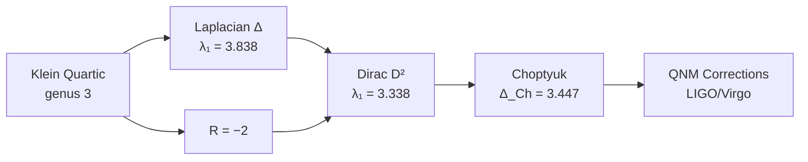

# Mathematics

Mathematical background for the Choptyuk Spinor Corrections framework.

## Topics

| Topic | Key Result |
|---|---|
| [Klein Quartic Curve](klein-quartic.md) | Genus 3, PSL(2,7) of order 168 |
| [Spinor Phases & Structures](spinor-phases.md) | 64 spinor structures, trivial $\sigma_0$ is minimum |
| [Dirac Operator](dirac-operator.md) | Lichnerowicz: $\lambda_1(D^2_{\sigma_0}) = \lambda_1(\Delta) + R/4 = 3.338$ |
| [Choptyuk Formula](choptyuk-formula.md) | $\Delta_{\mathrm{Ch}} = 3.447040$ with higher-order corrections |
| [Enhanced Verification (v2.0)](enhanced-verification.md) | 4D conformal invariance, K3, Tyukovsky equations |
| [K3 & Kähler Surfaces](k3-surfaces.md) | b₂ = 22, Dolbeault correspondence, hyperkähler structure |

## The Big Picture

