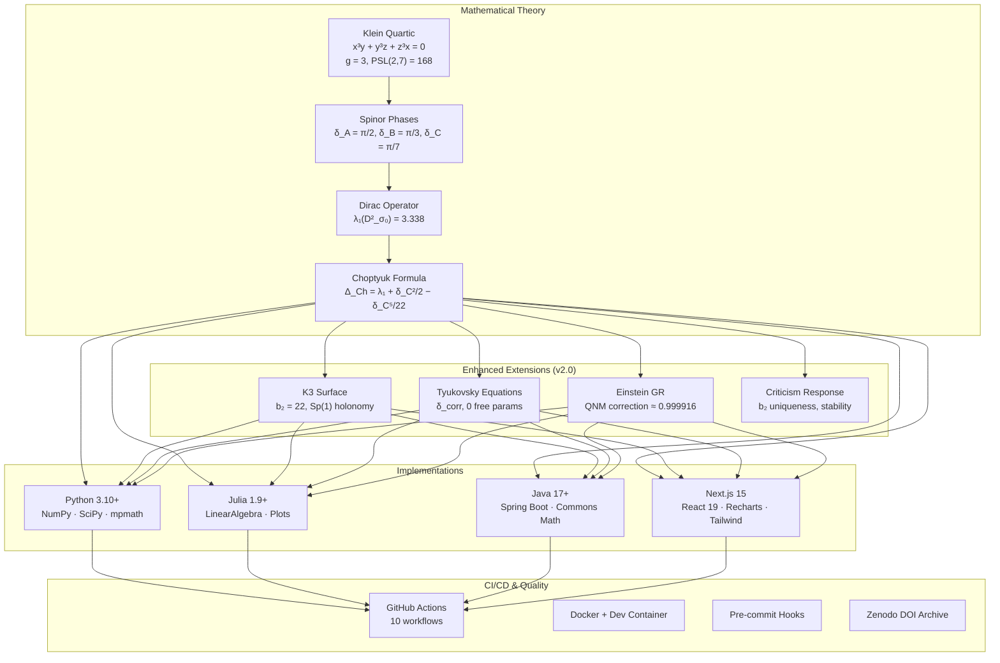

# Architecture Overview

## System Architecture

The Choptyuk Spinor Monograph project implements the mathematical verification pipeline across four independent technology stacks, ensuring cross-implementation consistency and computational reproducibility.



## Data Flow

### Core Pipeline

```
Klein Curve Parameters
    ↓
Spinor Phase Computation (δ_A, δ_B, δ_C)
    ↓
Dirac Operator Eigenvalue (Lichnerowicz)
    ↓
b-C Correction (1st order, Berry phase)
    ↓
a-C Braking (2nd order, δ_eff = δ_C⁵/22)
    ↓
Unified Choptyuk Formula (Δ_Ch)
    ↓
QNM Frequency Predictions (LIGO/Virgo)
```

### Enhanced Pipeline (v2.0)

```
Choptyuk Formula (Δ_Ch)
    ↓
    ├─→ 4D Spin Manifold Extension
    │       ├─ Conformal invariance check
    │       └─ Seiberg-Witten compatibility (b₂⁺ > 1)
    │
    ├─→ Kähler Surface Corrections
    │       ├─ Dolbeault correspondence (Δ_∂̄)
    │       ├─ K3 hyperkähler verification
    │       └─ I₇ elliptic fibration (δ_I₇ = δ_C)
    │
    ├─→ Tyukovsky Adaptation
    │       ├─ δ_corr = δ₀ + δ_C²/2 − δ_C⁵/22
    │       └─ Free parameters = 0
    │
    ├─→ Einstein GR Application
    │       ├─ QNM correction factor = 1 − δ_eff/π²
    │       └─ Detectability across detector generations
    │
    └─→ Criticism Response
            ├─ Non-coincidence (no better rational approx q < 1200)
            ├─ b₂ = 22 uniqueness (dev < 1% only for k = 22)
            └─ Deformation stability
```

## Module Structure

### Python (`python/src/`)

| Module | Classes | Purpose |
|---|---|---|
| `core/klein_curve.py` | `KleinCurve` | Klein quartic parameters, PSL(2,7) generators |
| `core/spinor_phases.py` | `SpinorPhases`, `SpinorStructure` | Phase computation, 64-structure enumeration |
| `core/dirac_operator.py` | `DiracOperator` | Lichnerowicz formula, spectral computation |
| `core/choptyuk_formula.py` | `ChoptyukFormula`, `ChoptyukResult` | Unified formula with all corrections |
| `core/qnm.py` | `QNMPredictor`, `BHEvent` | LIGO/Virgo QNM predictions |
| `core/hypothesis.py` | `HypothesisTester` | Parameter sweep, sensitivity analysis |
| `core/surfaces.py` | `SurfaceSpec` | Bolza, Bring, Macbeath comparisons |
| **`core/enhanced_verification.py`** | `KleinQuartic`, `K3Surface`, `QNMPredictor`, `TyukovskyAdapter`, `CriticismResponse` | **v2.0 enhanced verification** |
| `verification/verify_all.py` | — | Full verification runner |
| **`verification/verify_enhanced.py`** | — | **Enhanced verification runner** |
| `simulation/simulator.py` | `Simulator` | Parameter sweeps, convergence analysis |
| `visualization/plots.py` | — | Publication-quality figure generation |
| `reporting/report_writer.py` | `ReportWriter` | 7-format report generation |
| `ui/interactive_menu.py` | — | Interactive CLI menu |

### Julia (`julia/src/`)

| Module | Key Exports |
|---|---|
| `ChoptyukSpinor.jl` | Main module, all exports |
| `klein_curve.jl` | `KleinCurve`, `klein_generators`, `verify_relations` |
| `spinor_phases.jl` | `SpinorPhases`, `enumerate_64_structures` |
| `dirac_operator.jl` | `DiracOperator`, `lichnerowicz` |
| `choptyuk_formula.jl` | `choptyuk_formula`, `bC_correction`, `aC_braking` |
| `qnm.jl` | `QNMPredictor`, `predict_shift` |
| **`enhanced_verification.jl`** | `K3Surface`, `TyukovskyAdapter`, `verify_enhanced_all` |
| `hypothesis.jl` | `HypothesisTester`, `parameter_sweep` |
| `surfaces.jl` | `SurfaceSpec`, `compare_surfaces` |

### Java (`java-webapp/src/main/java/com/choptyuk/`)

| Package | Classes |
|---|---|
| `model/` | `KleinCurve`, `SpinorPhases`, `DiracOperator`, `ChoptyukFormula`, `QNMEvent`, `SurfaceSpec`, `HypothesisConfig`, **`K3Surface`**, **`TyukovskyEquation`**, **`EinsteinQNMCorrection`** |
| `controller/` | `VerificationController`, `ReportController`, `WebController`, **`EnhancedController`** |
| `service/` | `VerificationService`, `ReportService`, `SimulationService`, `PlotService` |
| `config/` | `AppConfig` |

### Next.js (`interactive-viz/src/`)

| Path | Purpose |
|---|---|
| `lib/compute.ts` | All mathematical computation functions (30+) |
| `lib/types.ts` | TypeScript interfaces for all data structures |
| `lib/simulation.ts` | Parameter sweep and simulation logic |
| `app/page.tsx` | Main dashboard |
| `app/verify/` | Verification page |
| **`app/enhanced/`** | **v2.0 Enhanced verification dashboard** |
| `app/simulate/` | Interactive simulation |
| `app/structures/` | 64 spinor structures |
| `app/surfaces/` | Riemann surface comparison |
| `app/qnm/` | QNM/LIGO predictions |
| `app/hypothesis/` | Hypothesis testing |

## Quality Gates

Every commit must pass through these gates before merging:

| Gate | Tool | Threshold |
|---|---|---|
| Python lint | ruff | 0 errors |
| Python type check | mypy | 0 errors |
| Python tests | pytest | All pass |
| Python coverage | coverage | ≥ 80% |
| Julia tests | Test.jl | All pass |
| Java build | Maven | SUCCESS |
| Java static analysis | SpotBugs | 0 high bugs |
| Java style | Checkstyle (Google) | 0 errors |
| Java coverage | JaCoCo | Tracked |
| TypeScript lint | ESLint | 0 errors |
| TypeScript types | tsc --noEmit | 0 errors |
| Next.js build | next build | SUCCESS |
| Cross-impl consistency | Custom | Deviations < 0.1% |
| Enhanced verification | Python | All constants match |
